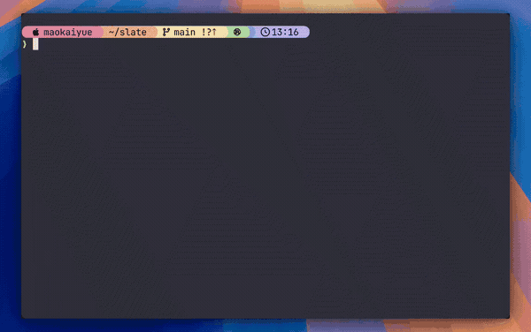
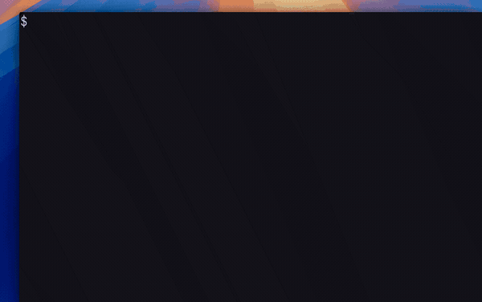
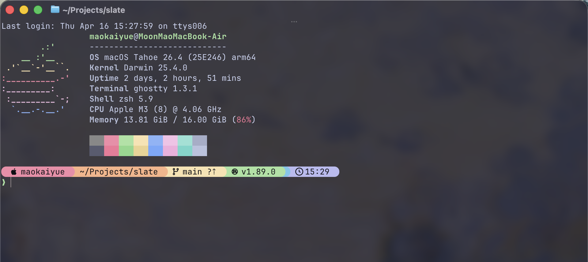

<p align="center">
  
</p>

<h1 align="center">slate</h1>

<p align="center">
  A one-command terminal setup for macOS and Linux — themes, prompts, fonts, and tools all in sync.
</p>

<p align="center">
  English · <a href="./README.zh-CN.md">简体中文</a>
</p>

<p align="center">
  <a href="https://github.com/MoonMao42/slate/releases"></a>
  
  
  
</p>

<p align="center">
  
  <br />
  <sub>Live preview — swap themes and see the whole stack update.</sub>
</p>

## Why I built this

I could never find a terminal-beautification tool that actually fit the way I use my machine. Every time I wanted a nice setup, I ended up chasing dotfile repos, copy-pasting snippets, and stacking plugins on top of plugins. After all that effort the environment would usually end up a mess, and when I needed to recover I had to dig through everything to figure out what had actually been changed.

So I wrote slate. One command sets up a coordinated look across your terminal, prompt, fonts, and CLI tools. Everything slate writes lives in files it owns, so when you want it gone, `slate clean` actually cleans.

## Install

```bash
# macOS — Homebrew
brew install MoonMao42/homebrew-tap/slate-cli

# macOS or Linux — install script
curl -fsSL https://raw.githubusercontent.com/MoonMao42/slate/main/install.sh | sh

# Rust users
cargo install slate-cli
```

Then run `slate setup`.

<p align="center">
  
  <br />
  <sub>One command: <code>slate setup</code>.</sub>
</p>

## What it does

- One palette across Ghostty, Kitty, Alacritty, Starship, bat, delta, eza, lazygit, fastfetch, tmux, and zsh-syntax-highlighting.
- 🌓 Auto dark/light pairing — native watcher on macOS, XDG Desktop Portal (with GNOME fallback) on Linux.
- Non-destructive: slate writes into managed include files and never edits your dotfiles in place. Snapshots before every change; one command to roll back.

<p align="center">
  
  <br />
  <sub>Terminal, prompt, system info, CLI utilities — same palette everywhere.</sub>
</p>

## Auto-theme

```
Light mode  →  your light theme + matching prompt, syntax, tools
Dark mode   →  your dark theme + matching prompt, syntax, tools
```

Enable from the hub (`slate` → Auto-Theme). Every theme family ships a built-in dark/light pair, and you can override the pairing there too.

## Support

Official targets: `x86_64-apple-darwin`, `aarch64-apple-darwin`, `x86_64-unknown-linux-gnu`, `aarch64-unknown-linux-gnu`. Linux is validated on Debian/Ubuntu + GNOME.

| Terminal | Status | Notes |
|----------|--------|-------|
| Ghostty | Recommended | Full support — live reload, opacity, watcher relaunch |
| Kitty | Full | Live push via remote control |
| Alacritty | Full | Inline preview and reload |
| Terminal.app | Partial | macOS only — no live preview, no opacity, font cannot be auto-applied |
| Other | Best effort | Shell and CLI tool theming works; terminal visuals depend on the app |

Shells: `zsh`, `bash`, `fish`. `zsh` is locally verified; `bash` and `fish` are wired up but pending broader testing.

<details>
<summary><strong>All commands</strong></summary>

```bash
slate                         # interactive hub
slate setup                   # guided setup
slate setup --quick           # non-interactive, defaults
slate setup --only starship   # retry a single tool
slate theme                   # live preview picker
slate theme <name>            # apply by name
slate theme --auto            # follow system dark/light
slate font                    # Nerd Font picker
slate config set opacity frosted  # solid / frosted / clear
slate config set sound off    # toggle feedback sound
slate export                  # export current config as URI
slate import <uri>            # re-apply from URI
slate share                   # screenshot terminal with watermark
slate status                  # show current config
slate list                    # list available themes
slate restore                 # pick a snapshot to roll back
slate restore --list          # list restore points
slate clean                   # remove everything slate wrote
```

</details>

<details>
<summary><strong>How it works</strong></summary>

Slate composes managed config files alongside your existing setup rather than replacing your dotfiles.

```text
~/.config/slate/config.toml        # preferences (theme, font, toggles)
~/.config/slate/auto.toml          # dark/light theme pairing
~/.config/slate/managed/<tool>/*   # generated assets slate owns
~/.config/<tool>/...               # your files, untouched
```

For Ghostty: `config-file = ...`. For Kitty/Alacritty: managed `include`/`import` entries. For zsh: a removable marker block in `.zshrc`. Slate-owned files stay slate-owned; yours stay yours.

</details>

## Themes

18 variants across 8 families: Catppuccin · Tokyo Night · Rosé Pine · Kanagawa · Everforest · Dracula · Nord · Gruvbox.

## License

MIT.

## Credits

Built on top of great work from others:
[Ghostty](https://ghostty.org/) · [Kitty](https://sw.kovidgoyal.net/kitty/) · [Alacritty](https://github.com/alacritty/alacritty) · [Starship](https://github.com/starship/starship) · [bat](https://github.com/sharkdp/bat) · [delta](https://github.com/dandavison/delta) · [eza](https://github.com/eza-community/eza) · [lazygit](https://github.com/jesseduffield/lazygit) · [fastfetch](https://github.com/fastfetch-cli/fastfetch) · [tmux](https://github.com/tmux/tmux) · [zsh-syntax-highlighting](https://github.com/zsh-users/zsh-syntax-highlighting) · [Nerd Fonts](https://github.com/ryanoasis/nerd-fonts).
