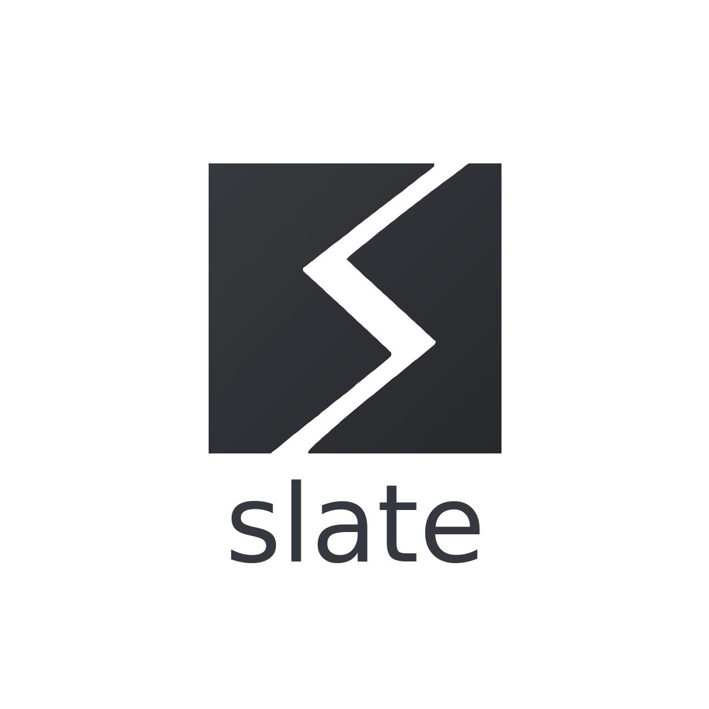

<p align="center">
  <!--  -->
</p>

<h1 align="center">slate</h1>

<p align="center">Beautiful terminal in 30 seconds</p>

<p align="center">
  <a href="LICENSE"></a>
  
  
  <a href="https://github.com/MoonMao42/slate-dev/releases"></a>
</p>

---

## See it in action

<!-- TODO: Replace with hero video (mp4/webp, 12-15s, 960x600) -->
> *Coming soon: setup wizard + live theme picker demo*

## Quick Start

```bash
brew install MoonMao42/tap/slate
slate setup
```

That's it. Your terminal is beautiful now.

## What You Get

One command configures your entire terminal stack:

| Tool | What slate does |
|------|----------------|
| Ghostty / Alacritty | Theme colors, font, opacity, blur |
| Starship | Prompt palette matching your theme |
| bat, delta, eza | Syntax highlighting & git colors |
| lazygit | UI colors synced to theme |
| fastfetch | System info card with themed colors |
| tmux | Status bar theme sync |
| zsh-syntax-highlighting | Command colors |
| Nerd Font | Icon font installation |

## Day & Night

slate follows your macOS appearance setting. Switch to Dark Mode and your entire terminal stack updates instantly.

<!-- TODO: dark/light comparison image -->

## Themes

18 built-in themes across 8 families:

**Catppuccin** Mocha  Macchiato  Frappe  Latte
**Tokyo Night** Night  Storm
**Rose Pine** Main  Moon  Dawn
**Kanagawa** Wave  Dragon  Lotus
**Everforest** Dark  Light
**Dracula**  **Nord**  **Gruvbox** Dark  Light

<!-- TODO: 4 hero theme screenshots + collapsible full gallery -->

## Everyday Usage

```bash
slate                  # Launch interactive hub
slate theme            # Pick a theme with live preview
slate font             # Change your Nerd Font
slate status           # See what's configured
slate restore          # Undo changes from a snapshot
```

## Safety Net

slate snapshots your configs before every change. Made a mess? `slate restore` takes you back.

- First-time setup creates a pre-mutation backup
- Every theme switch is reversible
- `slate clean` removes all slate-managed configs
- Your custom config files are never touched

<details>
<summary><strong>Command Reference</strong></summary>

| Command | Description |
|---------|-------------|
| `slate setup` | Interactive setup wizard |
| `slate setup --quick` | One-click setup with defaults |
| `slate theme [name]` | Set theme or launch picker |
| `slate font [name]` | Set font or launch picker |
| `slate status` | Show current configuration |
| `slate list` | List available themes |
| `slate clean` | Remove all slate-managed configs |
| `slate restore [id]` | Restore from snapshot |
| `slate restore --list` | List available snapshots |
| `slate config set opacity <value>` | Set opacity (solid/frosted/clear) |
| `slate config set auto-theme <enable/disable>` | Toggle auto dark/light mode |

</details>

## Philosophy

- **30-second Time-to-Dopamine** -- from install to beautiful
- **Sell taste, not code** -- curated presets, not config files
- **Transparent, never sneaky** -- see every change before it happens
- **Your configs, your rules** -- three-tier system never touches your overrides

## License

[MIT](LICENSE)
