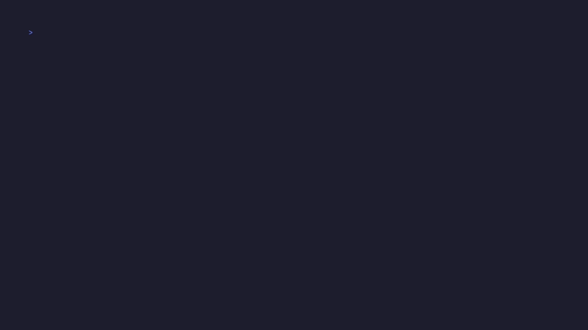
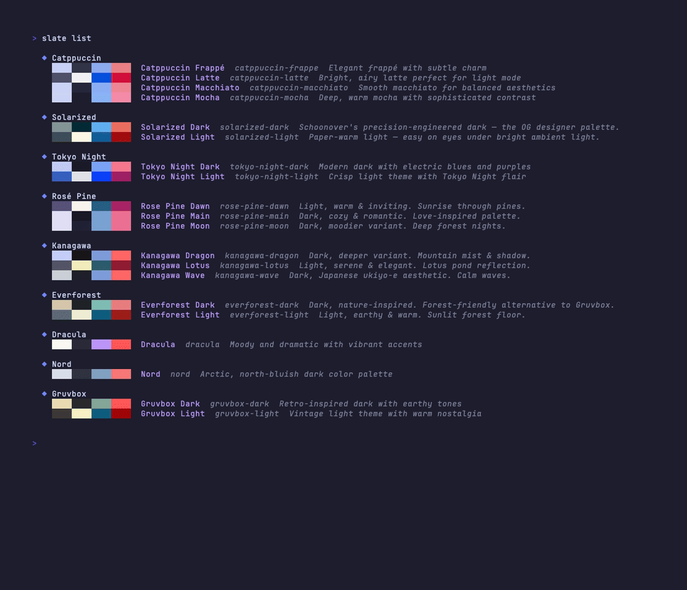
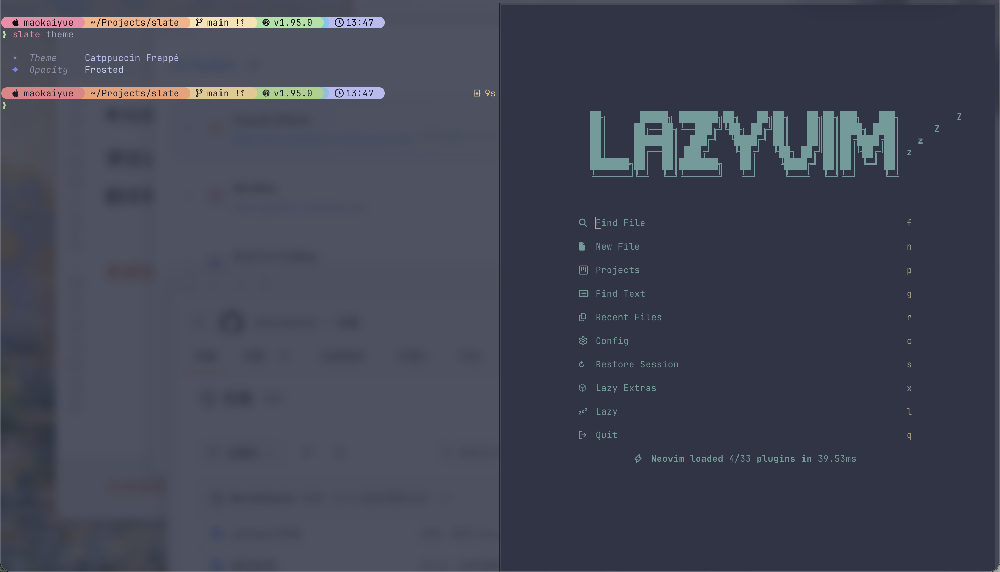
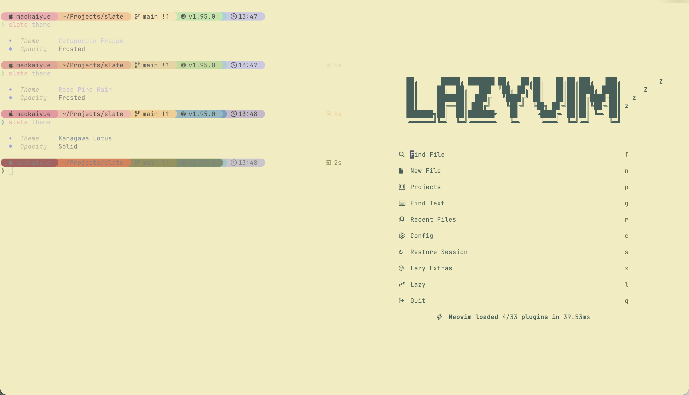

<p align="center">
  
</p>

<h1 align="center">slate</h1>

<p align="center">
  为 macOS 和 Linux 准备的一键终端配置：主题、提示符、字体、周边工具一次性调成同一套。
</p>

<p align="center">
  <a href="./README.md">English</a> · 简体中文
</p>

<p align="center">
  <a href="https://github.com/MoonMao42/slate/releases"></a>
  
  
  
</p>

<p align="center">
  
  <br />
  <sub>选一个主题，slate 把整套终端实时切过去，不用重启。</sub>
</p>

## 为什么做这个

我一直没找到一款真正顺手的终端美化工具。每次想把终端弄漂亮一点，就得去翻别人的 dotfile 仓库、到处抄配置、叠一堆插件。折腾半天，环境可能一团糟还恢复不过来，必须得去研究到底动了什么。

所以我写了 slate：一条命令把终端、提示符、字体、CLI 工具统一调成一套风格；所有 slate 写的东西都放在它自己管的文件里，想卸载就 `slate clean`，是真的干净。

## 安装

```bash
# macOS · Homebrew
brew install MoonMao42/homebrew-tap/slate-cli

# macOS 或 Linux · 一键脚本
curl -fsSL https://raw.githubusercontent.com/MoonMao42/slate/main/install.sh | sh

# Rust 用户
cargo install slate-cli
```

然后运行 `slate setup`。

<p align="center">
  
  <br />
  <sub><code>slate setup</code> 一键配置。</sub>
</p>

## 它做了什么

- 一套配色同步到 Ghostty、Kitty、Alacritty、Neovim、Starship、bat、delta、ls、eza、lazygit、fastfetch、tmux、zsh-syntax-highlighting。
- 🌓 自动跟随系统深浅色：macOS 走原生 watcher，Linux 优先走 XDG Desktop Portal（GNOME 可退回 `gsettings`）。
- 不改你的 dotfile：slate 写进自己管的 include 文件里，每次改动前先快照，一条命令可回滚。
- 所有命令共用一套视觉语言。标题、提示符号、树形结果都走同一个渲染契约，所以 `slate setup`、`slate status`、报错信息看起来都像出自一手。
- 主题应用、选择器翻动、配置完成和报错都有轻微反馈音。默认安静设计，不喜欢就 `slate config set sound off`。（v0.3.0 录像目前是无声的，原因见下方脚注。）

<p align="center">
  
  <br />
  <sub>终端、提示符、系统信息、常用 CLI，全部共用同一套配色。</sub>
</p>

<p align="center">
  
  <br />
  <sub><code>slate list</code> —— 9 个家族分组，Solarized 紧跟在 Catppuccin 后面。</sub>
</p>

<sub>* v0.3.0 的录像是无声渲染；等做完整套 SFX 库后会在 v2.2.x 重录带声音版本。</sub>

## Neovim 一起跟

slate 内置 18 套对应全部主题家族的 Neovim 配色，切换主题时已打开的 buffer 当场重载。

<p align="center">
  
</p>

<p align="center">
  
</p>

兼容 LazyVim、kickstart.nvim，或者一个裸 init.lua。

## 自动深浅色

```
浅色模式 → 浅色主题 + 匹配的提示符、语法高亮、工具配色
深色模式 → 深色主题 + 匹配的提示符、语法高亮、工具配色
```

从主菜单里开启（`slate` → Auto-Theme）。每个主题家族自带深浅色配对，也可以在主菜单里自己重新配对。

## 支持情况

官方构建目标：`x86_64-apple-darwin`、`aarch64-apple-darwin`、`x86_64-unknown-linux-gnu`、`aarch64-unknown-linux-gnu`。Linux 主要在 Debian/Ubuntu + GNOME 上验证。

| 等级 | 平台 | 状态与说明 |
|------|------|------------|
| Tier 1 — 一线（每次发版 CI smoke test） | macOS（Apple Silicon + Intel） | Ghostty、Kitty、Alacritty、Terminal.app（部分支持——无 live preview、无透明度、字体无法自动应用）。 |
| Tier 1 — 一线（每次发版 CI smoke test） | Debian / Ubuntu + GNOME（x86_64 + aarch64） | Ghostty、Kitty、Alacritty 全部接好；各自的热重载都跑通。 |
| Tier 2 — 尽力而为（接好但不进 CI） | 其他 Linux 发行版（Fedora、Arch）以及其他桌面（KDE、Sway） | 主题仍能应用；热重载视所用终端而定。 |
| Tier 3 — 不支持 | Windows | 没有支持计划。 |

Shell：`zsh`、`bash`、`fish`。`zsh` 已在本机验证；`bash` 与 `fish` 已接入，尚待更大范围测试。

<details>
<summary><strong>各终端逐项状态</strong></summary>

| 终端 | 状态 | 说明 |
|------|------|------|
| Ghostty | 最推荐 | 完整支持——热重载、透明度、watcher 自动拉起 |
| Kitty | 完整 | `kitten @ set-colors` 实时推送；透明度 + Nerd Font 同步 |
| Alacritty | 完整 | 行内预览与热重载 |
| Terminal.app | 部分 | 仅 macOS；不支持 live preview、不支持透明度、字体无法自动更换 |
| 其他 | 尽力而为 | Shell 与 CLI 工具层主题通用；终端自身视觉效果看其能力 |

</details>

<details>
<summary><strong>全部命令</strong></summary>

```bash
slate                         # 交互式主菜单
slate setup                   # 引导式配置
slate setup --quick           # 非交互、默认值
slate setup --only starship   # 单独重配某个工具
slate theme                   # 带实时预览的主题选择器
slate theme <name>            # 按名称应用
slate theme --auto            # 跟随系统深浅色
slate font                    # Nerd Font 选择器
slate config set opacity frosted  # 透明度：solid / frosted / clear
slate config set sound off    # 反馈音开关
slate export                  # 把当前配置导成 URI
slate import <uri>            # 从 URI 恢复配置
slate share                   # 截取带水印的终端图
slate status                  # 查看当前配置
slate list                    # 列出所有主题
slate restore                 # 选一个快照回滚
slate restore --list          # 列出所有回滚点
slate clean                   # 清除 slate 写下的一切
```

</details>

<details>
<summary><strong>工作原理</strong></summary>

slate 通过独立的 include 文件跟你现有的配置共存，不会替换你的 dotfile：

```text
~/.config/slate/config.toml        # 偏好（主题、字体、开关）
~/.config/slate/auto.toml          # 深浅色配对
~/.config/slate/managed/<tool>/*   # slate 自管的生成物
~/.config/<tool>/...               # 你自己的文件，原样不动
```

Ghostty 用 `config-file = ...`；Kitty/Alacritty 用 `include`/`import`；zsh/bash/fish 是 rc 文件里一段带明确 START/END 标记的代码块；Neovim 是 `init.lua`（或 `init.vim`）里一行 `pcall(require, 'slate')` —— slate 卸载后 pcall 自动降级为 no-op。slate 的文件归 slate 管，你自己的文件永远不动。

</details>

## 主题

共 20 款变体、9 个家族：Catppuccin · Solarized · Tokyo Night · Rosé Pine · Kanagawa · Everforest · Dracula · Nord · Gruvbox。

<details>
<summary><strong>20 款变体 · 调色板预览</strong></summary>

最近一次手动整理是 2026-04-28。后续若有漂移，由 `tests/docs_invariants.rs` 的 docs-invariants 测试兜底。色块顺序从左到右：背景 · 前景 · 品牌强调色 · 红色。

<!-- THEME-GALLERY-START -->
<!-- generated by scripts/render-theme-gallery.sh — do NOT hand-edit; regenerate from themes/themes.toml -->

| 家族 | 变体 | ID | 外观 | 调色板 |
|------|------|----|-----:|--------|
| Catppuccin | Catppuccin Frappé | `catppuccin-frappe` | Dark | <svg width="80" height="14" xmlns="http://www.w3.org/2000/svg"><rect width="20" height="14" x="0" fill="#303446"/><rect width="20" height="14" x="20" fill="#c6d0f5"/><rect width="20" height="14" x="40" fill="#babbf1"/><rect width="20" height="14" x="60" fill="#e78284"/></svg> |
| Catppuccin | Catppuccin Latte | `catppuccin-latte` | Light | <svg width="80" height="14" xmlns="http://www.w3.org/2000/svg"><rect width="20" height="14" x="0" fill="#eff1f5"/><rect width="20" height="14" x="20" fill="#4c4f69"/><rect width="20" height="14" x="40" fill="#7287fd"/><rect width="20" height="14" x="60" fill="#d20f39"/></svg> |
| Catppuccin | Catppuccin Macchiato | `catppuccin-macchiato` | Dark | <svg width="80" height="14" xmlns="http://www.w3.org/2000/svg"><rect width="20" height="14" x="0" fill="#24273a"/><rect width="20" height="14" x="20" fill="#cad3f5"/><rect width="20" height="14" x="40" fill="#b7bdf8"/><rect width="20" height="14" x="60" fill="#ed8796"/></svg> |
| Catppuccin | Catppuccin Mocha | `catppuccin-mocha` | Dark | <svg width="80" height="14" xmlns="http://www.w3.org/2000/svg"><rect width="20" height="14" x="0" fill="#1e1e2e"/><rect width="20" height="14" x="20" fill="#cdd6f4"/><rect width="20" height="14" x="40" fill="#b4befe"/><rect width="20" height="14" x="60" fill="#f38ba8"/></svg> |
| Solarized | Solarized Dark | `solarized-dark` | Dark | <svg width="80" height="14" xmlns="http://www.w3.org/2000/svg"><rect width="20" height="14" x="0" fill="#002b36"/><rect width="20" height="14" x="20" fill="#839496"/><rect width="20" height="14" x="40" fill="#6c71c4"/><rect width="20" height="14" x="60" fill="#ea6e60"/></svg> |
| Solarized | Solarized Light | `solarized-light` | Light | <svg width="80" height="14" xmlns="http://www.w3.org/2000/svg"><rect width="20" height="14" x="0" fill="#fdf6e3"/><rect width="20" height="14" x="20" fill="#3e4d52"/><rect width="20" height="14" x="40" fill="#6c71c4"/><rect width="20" height="14" x="60" fill="#a00d0d"/></svg> |
| Tokyo Night | Tokyo Night Dark | `tokyo-night-dark` | Dark | <svg width="80" height="14" xmlns="http://www.w3.org/2000/svg"><rect width="20" height="14" x="0" fill="#1a1b26"/><rect width="20" height="14" x="20" fill="#c0caf5"/><rect width="20" height="14" x="40" fill="#bb9af7"/><rect width="20" height="14" x="60" fill="#f7768e"/></svg> |
| Tokyo Night | Tokyo Night Light | `tokyo-night-light` | Light | <svg width="80" height="14" xmlns="http://www.w3.org/2000/svg"><rect width="20" height="14" x="0" fill="#e1e2e7"/><rect width="20" height="14" x="20" fill="#3760bf"/><rect width="20" height="14" x="40" fill="#5a4a78"/><rect width="20" height="14" x="60" fill="#9f1f63"/></svg> |
| Rosé Pine | Rose Pine Dawn | `rose-pine-dawn` | Light | <svg width="80" height="14" xmlns="http://www.w3.org/2000/svg"><rect width="20" height="14" x="0" fill="#faf4ed"/><rect width="20" height="14" x="20" fill="#575279"/><rect width="20" height="14" x="40" fill="#907aa9"/><rect width="20" height="14" x="60" fill="#a72464"/></svg> |
| Rosé Pine | Rose Pine Main | `rose-pine-main` | Dark | <svg width="80" height="14" xmlns="http://www.w3.org/2000/svg"><rect width="20" height="14" x="0" fill="#191724"/><rect width="20" height="14" x="20" fill="#e0def4"/><rect width="20" height="14" x="40" fill="#c4a7e7"/><rect width="20" height="14" x="60" fill="#eb6f92"/></svg> |
| Rosé Pine | Rose Pine Moon | `rose-pine-moon` | Dark | <svg width="80" height="14" xmlns="http://www.w3.org/2000/svg"><rect width="20" height="14" x="0" fill="#232136"/><rect width="20" height="14" x="20" fill="#e0def4"/><rect width="20" height="14" x="40" fill="#c4a7e7"/><rect width="20" height="14" x="60" fill="#eb6f92"/></svg> |
| Kanagawa | Kanagawa Dragon | `kanagawa-dragon` | Dark | <svg width="80" height="14" xmlns="http://www.w3.org/2000/svg"><rect width="20" height="14" x="0" fill="#181616"/><rect width="20" height="14" x="20" fill="#c5d0ff"/><rect width="20" height="14" x="40" fill="#8ba4b0"/><rect width="20" height="14" x="60" fill="#ff6666"/></svg> |
| Kanagawa | Kanagawa Lotus | `kanagawa-lotus` | Light | <svg width="80" height="14" xmlns="http://www.w3.org/2000/svg"><rect width="20" height="14" x="0" fill="#f2ecbc"/><rect width="20" height="14" x="20" fill="#545464"/><rect width="20" height="14" x="40" fill="#4d699b"/><rect width="20" height="14" x="60" fill="#8e1b32"/></svg> |
| Kanagawa | Kanagawa Wave | `kanagawa-wave` | Dark | <svg width="80" height="14" xmlns="http://www.w3.org/2000/svg"><rect width="20" height="14" x="0" fill="#1f1f28"/><rect width="20" height="14" x="20" fill="#c8d1d8"/><rect width="20" height="14" x="40" fill="#938aa9"/><rect width="20" height="14" x="60" fill="#ff6666"/></svg> |
| Everforest | Everforest Dark | `everforest-dark` | Dark | <svg width="80" height="14" xmlns="http://www.w3.org/2000/svg"><rect width="20" height="14" x="0" fill="#1e2326"/><rect width="20" height="14" x="20" fill="#d3c6aa"/><rect width="20" height="14" x="40" fill="#a7c080"/><rect width="20" height="14" x="60" fill="#e67e80"/></svg> |
| Everforest | Everforest Light | `everforest-light` | Light | <svg width="80" height="14" xmlns="http://www.w3.org/2000/svg"><rect width="20" height="14" x="0" fill="#efebd4"/><rect width="20" height="14" x="20" fill="#5c6a72"/><rect width="20" height="14" x="40" fill="#8da101"/><rect width="20" height="14" x="60" fill="#9d1f1a"/></svg> |
| Dracula | Dracula | `dracula` | Dark | <svg width="80" height="14" xmlns="http://www.w3.org/2000/svg"><rect width="20" height="14" x="0" fill="#282a36"/><rect width="20" height="14" x="20" fill="#f8f8f2"/><rect width="20" height="14" x="40" fill="#bd93f9"/><rect width="20" height="14" x="60" fill="#ff5555"/></svg> |
| Nord | Nord | `nord` | Dark | <svg width="80" height="14" xmlns="http://www.w3.org/2000/svg"><rect width="20" height="14" x="0" fill="#2e3440"/><rect width="20" height="14" x="20" fill="#d8dee9"/><rect width="20" height="14" x="40" fill="#88c0d0"/><rect width="20" height="14" x="60" fill="#ff7777"/></svg> |
| Gruvbox | Gruvbox Dark | `gruvbox-dark` | Dark | <svg width="80" height="14" xmlns="http://www.w3.org/2000/svg"><rect width="20" height="14" x="0" fill="#282828"/><rect width="20" height="14" x="20" fill="#ebdbb2"/><rect width="20" height="14" x="40" fill="#fe8019"/><rect width="20" height="14" x="60" fill="#ff5555"/></svg> |
| Gruvbox | Gruvbox Light | `gruvbox-light` | Light | <svg width="80" height="14" xmlns="http://www.w3.org/2000/svg"><rect width="20" height="14" x="0" fill="#fbf1c7"/><rect width="20" height="14" x="20" fill="#3c3836"/><rect width="20" height="14" x="40" fill="#af3a03"/><rect width="20" height="14" x="60" fill="#9d0006"/></svg> |

<!-- THEME-GALLERY-END -->

</details>

## 开发说明

借助 AI 辅助开发，每一处改动都经过人工 review 和测试后才合入。

## 许可

MIT。

## 致谢

站在一堆很棒的项目之上：
[Ghostty](https://ghostty.org/) · [Kitty](https://sw.kovidgoyal.net/kitty/) · [Alacritty](https://github.com/alacritty/alacritty) · [Neovim](https://neovim.io/) · [Starship](https://github.com/starship/starship) · [bat](https://github.com/sharkdp/bat) · [delta](https://github.com/dandavison/delta) · [eza](https://github.com/eza-community/eza) · [lazygit](https://github.com/jesseduffield/lazygit) · [fastfetch](https://github.com/fastfetch-cli/fastfetch) · [tmux](https://github.com/tmux/tmux) · [zsh-syntax-highlighting](https://github.com/zsh-users/zsh-syntax-highlighting) · [Nerd Fonts](https://github.com/ryanoasis/nerd-fonts)。
