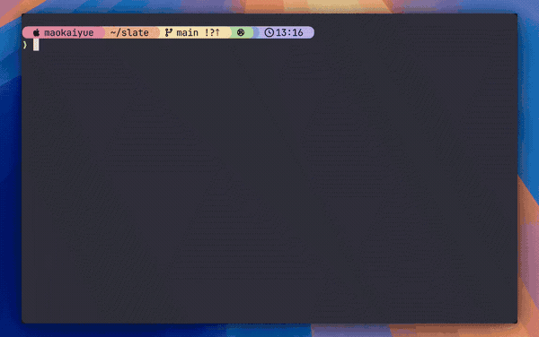
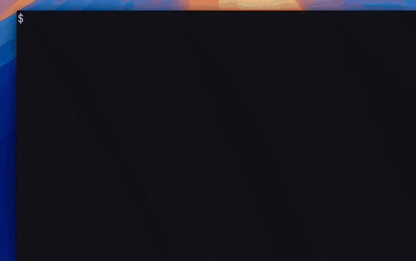
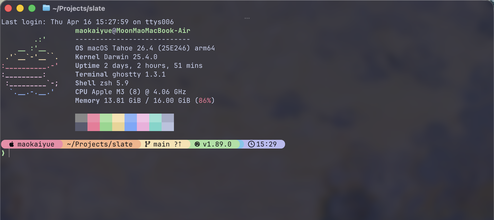
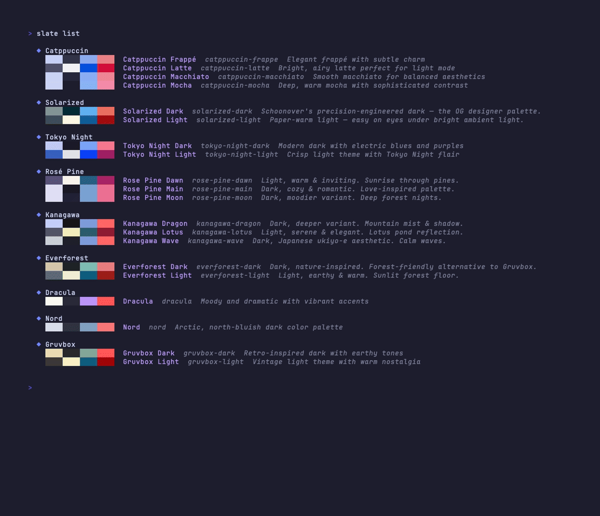
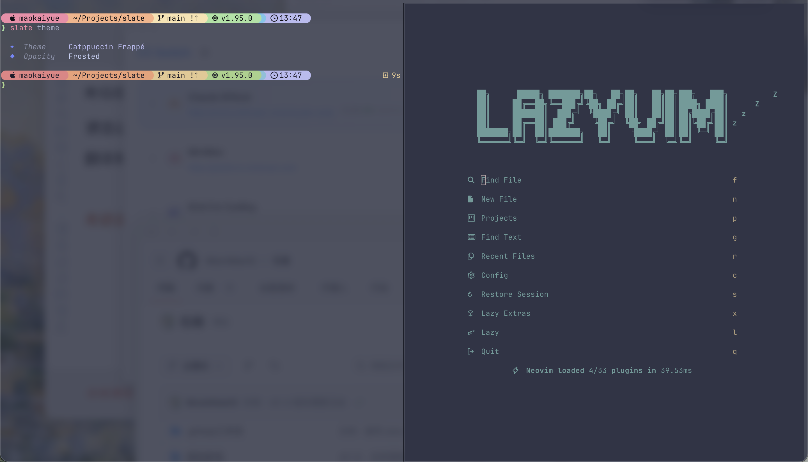
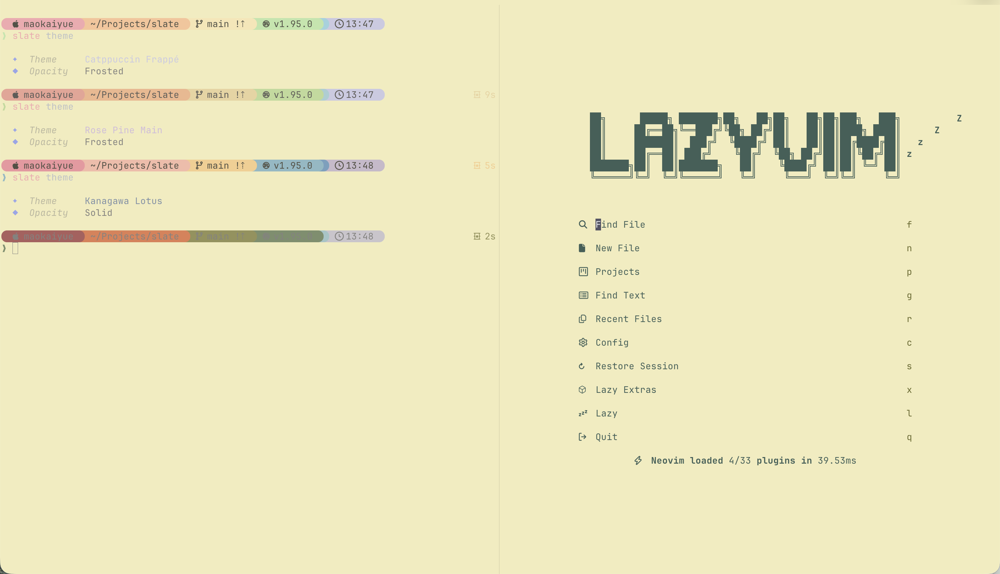

<p align="center">
  
</p>

<h1 align="center">slate</h1>

<p align="center">
  为 macOS 和 Linux 准备的一键终端配置：主题、提示符、字体、周边工具一次性调成同一套。
</p>

<p align="center">
  <a href="./README.md">English</a> · 简体中文
</p>

<p align="center">
  <a href="https://github.com/MoonMao42/slate/releases"></a>
  
  
  
</p>

<p align="center">
  
  <br />
  <sub>选一个主题，slate 把整套终端实时切过去，不用重启。</sub>
</p>

## 为什么做这个

我一直没找到一款真正顺手的终端美化工具。每次想把终端弄漂亮一点，就得去翻别人的 dotfile 仓库、到处抄配置、叠一堆插件。折腾半天，环境可能一团糟还恢复不过来，必须得去研究到底动了什么。

所以我写了 slate：一条命令把终端、提示符、字体、CLI 工具统一调成一套风格；所有 slate 写的东西都放在它自己管的文件里，想卸载就 `slate clean`，是真的干净。

## 安装

```bash
# macOS · Homebrew
brew install MoonMao42/tap/slate-cli

# macOS 或 Linux · 一键脚本
curl -fsSL https://raw.githubusercontent.com/MoonMao42/slate/main/install.sh | sh

# Rust 用户
cargo install slate-cli
```

然后运行 `slate` 进入菜单；只有需要整套终端、字体和 Shell 接入时才运行 `slate setup`。

通过脚本安装的版本，重新运行安装脚本即可升级。脚本会校验归档的 SHA-256，
在目标目录内暂存新文件，然后原子替换旧版本；最后的重命名步骤之前失败时，
旧可执行文件保持不变。若恰好在重命名瞬间中断，目标可能是旧版或完整的新版。
它不会运行下载的程序，也不会修改 Slate 配置；
升级成功后不保留旧可执行文件的备份。如果目标是符号链接，请使用管理它的包管理器
（Homebrew 使用 `brew upgrade slate-cli`），或用 `SLATE_INSTALL_DIR` 选择独立目录。

<p align="center">
  
  <br />
  <sub><code>slate setup</code> 一键配置。</sub>
</p>

## 先试一项，不必重新配置整个终端

先运行 `slate --help` 确认当前可执行文件提供 `tools` 和 `prompt`。
这里描述的是本分支功能；较旧的已安装版本可能没有这些入口。若命令不存在，先确认
终端实际调用的程序路径（macOS／Linux：`command -v slate`），不要直接重跑完整安装向导。

1. **只看样式和工具**：`slate prompt --list` 查看五种提示符示意，
   `slate tools` 浏览工具详情。打开详情不会安装软件或同步配色；示意不是当前终端截图。
2. **只改提示符布局**：先运行 `slate prompt classic --dry-run` 查看写入范围，
   再运行 `slate prompt classic` 审阅并确认。需要已有保存的主题和对应接入；不安装工具。
3. **只同步一个工具**：例如 `slate tools info btop`，然后
   `slate tools sync btop --dry-run`。确认目标路径后才运行 `slate tools sync btop`；
   需要已检测到该工具和已保存主题，不会安装软件或修改 Shell 启动文件。
   确认期间若目标文件内容、权限或文件身份变化，会停止并要求重新审阅。
   读取上限为单文件 8 MiB、合计 64 MiB；复核不是阻止外部编辑器写入的原子锁。
4. **想撤回**：`slate restore --list` 找到本次操作的恢复点，使用
   `slate restore <ID> --dry-run` 先看恢复范围，再用 `slate restore <ID>` 进入恢复流程。
   将 `<ID>` 替换为列表里的实际 ID。文件恢复不会自动撤销派生缓存或运行中应用的状态。

`slate theme` 的实时预览可能临时修改多个已检测到的适配器，不是只读看图；
Esc 用于恢复预览文件。`slate clean` 用于移除接入，不等于恢复之前的个人配置。
每次先改一项，按完成提示检查实际应用效果，再继续下一项。

## 它做了什么

- 一套配色同步到 Ghostty、Kitty、Alacritty、Neovim、Starship、bat、btop、Yazi、Zellij、delta、ls、eza、lazygit、fastfetch、tmux、zsh-syntax-highlighting。

- 🌓 自动跟随系统深浅色：macOS 走原生 watcher，Linux 优先走 XDG Desktop Portal（GNOME 可退回 `gsettings`）。
- 配色保存在独立文件中，只向现有配置添加必要的集成设置；支持快照和只读恢复预览，便于检查与撤销改动。
- 所有命令共用一套视觉语言。标题、提示符号、树形结果都走同一个渲染契约，所以 `slate setup`、`slate status`、报错信息看起来都像出自一手。
- 主题应用、选择器翻动、配置完成和报错都有轻微反馈音。默认安静设计，不喜欢就 `slate config set sound off`。（README 录屏是无声的；实际运行时已包含反馈音。）

<p align="center">
  
  <br />
  <sub>终端、提示符、系统信息、常用 CLI，全部共用同一套配色。</sub>
</p>

<p align="center">
  
  <br />
  <sub><code>slate list</code> —— 9 个家族分组，Solarized 紧跟在 Catppuccin 后面。</sub>
</p>

<sub>* GitHub README 录屏无声；安装后的 CLI 仍会播放内置反馈音，除非手动关闭。</sub>

## Zsh 命令高亮

使用插件原生字段设置命令、引号参数、选项、路径和未知命令的颜色，不替换高亮器列表，
也不清空无关的自定义样式。已验证全部内置主题的内建命令、引号字符串和未知命令高亮区域；
替换前景色时保留下划线、加粗和背景属性；移除会取消新前景色的 `none` 重置。
重复加载不会累积属性或遗留辅助变量。
其他语法场景及个人终端的实时效果尚未验证。已有 Shell 需要加载更新后的片段才会改变颜色。
`tools sync zsh-syntax-highlighting` 只更新托管片段，保留权限，相同内容不重写，不加载
插件或修改 `.zshrc`。文件恢复点只覆盖片段，不恢复运行中 Shell 的样式。
注释色以主题不透明背景上的 4.5:1 对比度为目标；原色足够清晰时保留，否则使用主题内
较清晰的灰色或正文色。透明窗口和个人覆盖不在该对比度保证范围内。

## Fastfetch 预设同步

`slate tools sync fastfetch --dry-run` 审阅单个托管 `config.jsonc`。它是带主题配色的
Slate 预设布局，不会合并个人模块或 Logo。同步只更新托管预设，保留文件权限，内容相同
时不重写；个人配置和 Shell 启动文件不变。恢复点只覆盖这一文件，不包含 Shell 变量
或已安装软件。需要现有 Slate Shell 包装函数选择该配置，生成成功不等于已接入。
新版 Bash／Zsh／Fish 包装函数在预设缺失、不可读、不是普通文件或为末端符号链接时，
不追加托管 `-c` 参数，保留原生配置选择和用户参数。此改动需要重新生成 Shell 接入；
只同步配色不会安装新的包装函数。
显式传入 `-c`／`--config` 时不再额外插入 Slate 配置，避免 fastfetch 拒绝同时加载两份配置。
帮助、版本和只读 `--list-*` 查询也绕过托管预设，避免损坏的 Slate 配置挡住这些入口。
配置生成和普通渲染不归入只读查询。
已用本机 fastfetch 2.68.1 验证全部内置主题的键名、分隔符和正文颜色输出。检查使用固定
文本替代系统模块并关闭 Logo，不代表完整系统信息布局、Logo 或个人 Shell 接入已验证。

## Eza 列表配色

Eza 的托管 `theme.yml` 使用原生文件类型、权限、大小、硬链接、用户、Git 状态和元数据颜色字段，不强制
图标或背景。新 Shell 加载 Slate 的 `EZA_CONFIG_DIR` 和颜色变量；`EZA_COLORS`／
`LS_COLORS` 可能覆盖文件配色，因此文件生成成功不等于启动环境已接入。已用本机
eza 0.23.5 在隔离配置中验证全部内置主题的目录、普通文件、可执行文件和符号链接输出。

`tools sync eza --dry-run` 审阅单个托管文件。应用保留权限，内容一致时不重写，拒绝
不安全或超限的原文件；不修改 Shell 启动文件和个人 eza 配置。同步恢复点只覆盖这一份
配色文件，不包含软件安装或当前 Shell 环境变量。
配置查询统一记录 `EZA_CONFIG_DIR`；设置 `SLATE_HOME` 时忽略主机覆盖，使用隔离目录
下的 `.config/eza`。自定义目录不因此成为同步目标，生成配色仍写入 Slate 托管目录。

从启动 eza 的 Shell 运行 `slate doctor eza`，或在工具详情选择 **Check Theme Setup**。
只读检查分别报告托管配色是否匹配、捕获的目录选择，以及 `EZA_COLORS`／`LS_COLORS`
是否存在覆盖；不启动 eza、不读个人 YAML、不解析颜色表达式。目录别名、Shell 启动逻辑
和实际显示仍需另外确认。
若捕获的目录已指向 Slate，但托管配色文件缺失，会单独报错；缺失与不可读会区分，
检查本身不会自动重建文件。

## Lazygit 界面配色

Lazygit 只生成界面配色，保留个人布局、快捷键和分页器设置。新版 Shell 接入用
逗号组合实际存在且可读的配置文件，个人配置放在最后；自己指定的 `LG_CONFIG_FILE`
保持不变，因此也可能绕过 Slate 配色。应用后请从新 Shell 重新打开 Lazygit。
`tools sync lazygit` 只更新配色片段，不改启动文件；旧 Shell 接入需通过确认后的
`slate setup` 重新生成。配置能加载不代表已验证实际界面观感。

从启动 Lazygit 的 Shell 运行 `slate doctor lazygit`，或进入工具详情的
**Check Theme Setup**。只读检查会比较生成配色，指出本次环境选择的配置、旧冒号
列表和缺失文件；不改自定义配置，不执行启动脚本，不解析个人 YAML，也不操作
运行中的 Git 客户端。支持 `--json`；隔离配置忽略宿主 `LG_CONFIG_FILE`。

## Fastfetch 配置检查

运行 `slate doctor fastfetch`，或在工具详情选择 **Check Theme Setup**，
可检查 Slate 生成的完整预设是否与已保存主题一致。检查不运行 Fastfetch、
不收集系统信息、不修改文件。文件缺失、无法安全读取与内容不同会分别报告；
不会判断个人布局、Shell 包装函数、显式 `--config` 参数或实际显示效果。
支持 `--json` 输出。
比较时忽略注释与标准 JSON 空白；字段顺序、标点和实际值仍须与生成预设一致。

## btop 跟随统一配色

btop 已加入引导式工具设置，支持全部 20 套内置配色。Slate 在
`$XDG_CONFIG_HOME/btop/themes/slate-sync.theme`（默认 `~/.config/btop/themes/`）
生成带归属标记的主题文件，只修改 `btop/btop.conf` 的 `color_theme` 值。
布局、刷新频率、透明背景开关及其他设置保留，不增加启动脚本或包装命令。
依据 [btop 的主题目录机制](https://github.com/aristocratos/btop/blob/v1.4.7/src/btop_theme.cpp)；
自定义 `btop --config` 配置和主题目录优先级不自动探测。

应用后重新打开 btop；已运行的窗口退出时可能写回旧主题，此时再应用一次 Slate。
不发送信号，不宣称实时重载。快速设置不会自动安装缺失的 btop；引导安装可选，
走 Homebrew 或已映射的 apt `btop` 包，以实际可用性为准。
`slate setup --only btop` 会明确重试安装，不是预览或仅修改主题的命令。

主题恢复点和设置基线均覆盖配置与主题文件，包括原先不存在的文件及权限。
清理预览会显示影响：实际清理只把 Slate 的精确引用改回 btop 默认主题，并删除带标记的
主题文件，保留其他主题。恢复先前个人主题请使用应用前的恢复点。没有 Slate 标记的同名
文件不会被覆盖或删除；配置歧义、不安全链接、超大文件和检测到的外部改动会阻止操作。
这不是多文件原子事务。

## Yazi 文件管理器配色

Yazi adapter 生成界面与代码预览配色，覆盖全部 20 套内置主题，采用
[官方 flavor 合并机制](https://yazi-rs.github.io/docs/flavors/overview/)。
只更新 `theme.toml` 的 `[flavor].dark/light` 为 `slate-sync`，并写入
`flavors/slate-sync.yazi/flavor.toml` 与 `tmtheme.xml`；不改按键、插件、文件打开规则或启动脚本。
个人 `theme.toml` 中其他字段与注释保留，个人样式覆盖依然优先，所以最终外观未必完全相同。
两个深浅槽位均跟随 Slate 当前选定的主题，不另建一套自动配色策略。

```sh
slate tools sync yazi --dry-run   # 先看三个潜在写入目标
slate tools sync yazi            # 明确确认后同步，不安装软件
```

配置目录采用绝对 `YAZI_CONFIG_HOME` 或标准 XDG 路径；`SLATE_HOME` 隔离时忽略宿主覆盖。
空覆盖视为未设置，相对覆盖在写入前拒绝，避免猜测目标。配色字段依据 Yazi 26.9.1；
旧版兼容性不保证，不在列表／预览时启动 Yazi。应用后重新打开文件管理器，不宣称实时重载。
可在支持 Homebrew 的引导设置中选择安装；Linux 未添加未经验证的 apt 映射，先手动安装。
快速设置不会自动安装缺失的 Yazi。

同步恢复点和设置基线覆盖三个文件及原始缺失／权限。清理预览与执行仅移除精确的 Slate
flavor 选择及带归属标记的两个资产，保留其他配色、个人覆盖和空目录；恢复旧选择请使用
应用前快照。无标记同名资产、不安全链接、非普通文件、超过 8 MiB 的文件或检测到的外部
改动会阻止覆盖。资产先写、选择后写；多文件失败可能留下部分改动，可用本次恢复点检查和恢复。

## Zellij 工作区配色

Zellij 的标签栏、面板边框和状态组件可跟随全部 20 套内置主题，采用
[原生组件配色格式](https://zellij.dev/documentation/themes)。Slate 生成带归属标记的
`themes/slate-sync.kdl`，只修改 `config.kdl` 顶层 `theme`、`theme_dark`、`theme_light`
三个字符串值。三个槽位统一跟随 Slate 保存的主题，不让原生深浅检测另选配色。
个人快捷键、布局、插件、注释和其他格式保留。适配依据 Zellij 0.45.1／KDL v1；不保证
旧版兼容。发现和同步都不启动 Zellij，不向会话发送命令。

```sh
slate tools info zellij
slate tools sync zellij --dry-run # 先看两个目标路径
slate tools sync zellij           # 确认后同步；不会安装 Zellij
```

路径遵循 Zellij 的[配置查找顺序](https://zellij.dev/documentation/configuration)，支持
独立的绝对 `ZELLIJ_CONFIG_DIR`／`ZELLIJ_CONFIG_FILE` 和配置内绝对 `theme_dir`。
仅覆盖配置文件不会把主题目录移到该文件旁边。未覆盖时，`~/.config/zellij` 优先于平台
目录（macOS Application Support 或 Linux XDG）。`SLATE_HOME` 隔离时忽略宿主覆盖。
空值、相对路径、隐式 `/etc/zellij`、KDL 歧义、不安全文件或同名个人主题会阻止写入。
本次运行首次检查后会固定目标路径及目录链接指向；若发生变化，需重新打开 Slate 审阅。
其他 `.kdl` 主题会检查同名冲突，检查上限为 256 个目录项／合计 8 MiB。
可通过已有审阅流程选择 [Homebrew 安装](https://formulae.brew.sh/formula/zellij)；
未添加 apt 映射，快速设置不会自动安装缺失的 Zellij。

KDL 另有单文件复杂度上限 128：最大子节点嵌套层数加上 `/-` 指令总数（包括被忽略的
节点／参数）。普通字符串、原始字符串及行／块注释的正文不计入。超过这个保守上限会
在解析或适配器写入前明确报错，不偷偷简化原配置。块注释仅在内部解析副本中等长屏蔽，
避免底层 KDL v1 注释递归造成栈溢出；原文件的注释、格式和编辑位置保持不变。
解析使用进程内独立线程，预留 32 MiB 栈空间，不启动 Zellij，也不因此修改文件。

原生文件监听可能更新现有会话，但 Slate 不验证实时外观；布局／命令行覆盖仍可能优先，
必要时用这份配置新开会话。同步恢复点和设置基线覆盖两个文件及原始缺失／权限。
清理仅把精确的 Slate 选择改回 `default`，仅删除带归属标记的主题文件；恢复原有个人
选择请使用应用前快照。主题先写、选择后写，多文件失败保留恢复点，不自动回滚部分改动。

## 从哪里开始

在终端运行 `slate` 打开菜单，第一项是预览／切换主题；Enter 应用，Esc 恢复预览改动。
“Connect Tools”打开工具页，可单独同步一个工具、查看检测结果，或主动进入安装／启动接入向导；
“Shell Preferences”只控制提示符、
语法高亮和启动信息，不再冒充适配器列表；“Check Status”只读查看状态。
无法识别或读取的设置会明确提示，不会显示成已应用默认主题。非交互运行只显示
只读状态和下一步命令，不打开菜单；存在未完成的预览时仍优先处理恢复。

操作成功后回到主页，并刷新已保存的设置；取消主题预览后，先恢复文件再回主页。
工具页可以连续预览写入范围、确认或拒绝同步、检查支持的配色接入，无需反复运行 Slate。
Back 返回上一层，Quit／Leave Tools 结束；离开时保留已经确认的改动，返回不是撤销。
普通菜单按 Esc／Ctrl+C 退出，主题选择器仍按原有逻辑取消并恢复预览；出错会停止，
不会默默重试。

仅打开“Shell Preferences”或“Auto-Theme”子菜单再返回，不创建配置、声音缓存或写锁。
选择修改后才准备写入；配对配置和安装向导仍走各自的审阅流程。`slate tools sync btop`、
`slate prompt minimal` 等直接操作保持一次执行，非交互查看不会进入循环。

## 看清正在试用哪一版

主页的 **About This Build** 显示当前执行文件路径、内嵌源码标识、编译目标、Cargo
profile 类别／features，以及这一版内置的主题、适配器和提示符样式。这里的 `debug`／
`release` 来自 Cargo 的分类，不是 `preview-next` 等自定义 profile 名称，也不完整描述优化设置。
区分试用版请对照执行文件路径与源码标识。看完可以返回主页，
不修改设置。对照本地安装版和开发版时，可以使用：

```sh
slate -V                         # 保持原来的简短包版本
slate --version                  # 包版本、源码标识、编译目标和 profile
slate about                      # 当前执行文件及其内置能力
slate about --json               # schema_version 为 1 的只读报告
```

直接命令无需 HOME、有效配置或 Git；存在写锁、待恢复预览、损坏配置时也能运行。
不探测已安装工具、不读取个人配置、不运行原生探针，也不检查更新。能力列表来自
编译进这一版的注册表，不表示已经安装、接入或实际生效。执行路径可能包含用户名，
分享报告前请检查；路径或源码标识不可得时 JSON 为 `null`，非 UTF-8 路径会标记有损显示。

`fnv1a64-v1-…` 是编译时计算的非加密标识：按排序后的相对路径与文件字节覆盖
`src/**/*.rs`、Cargo 清单及锁文件、构建脚本和指定内嵌资源，精确输入见
`build_metadata.rs`。不包含无关文档、`.git`、编译产物、时间戳和构建机器的绝对路径。
输入缺失、不可读、含符号链接或超过限制时明确显示不可用，不输出部分标识；扫描最多
16,384 个源码目录项、64 层子目录和 64 MiB。这不是 Git 提交号、签名、二进制校验和或
精确产物身份：编译器、原生 helper 和编译选项不同，仍可能得到相同源码标识。
另行显示 Cargo 规范化的 feature 名称及 `debug`／`release` profile 分类；打包时规范化
清单也可能改变源码标识。运行已编译文件不需要源码仓库。

## 按用途浏览工具

工具菜单的 **按用途找工具** 提供终端窗口、命令提示符与 Shell、文件与系统、
开发工具、分屏会话五个用途分组。例如只想比较 tmux 和 Zellij，可直接进入
分屏会话。分组只用于浏览，不会批量安装或同步；全部工具目录仍保留。

## 提示符样式，与颜色分开选

样式页的 **Check Current Prompt** 可只读检查本次环境选择的 Starship 配置、
已保存布局和启用偏好；配置读不出来时也可进入，检查后返回原样式页。
它不会启动工具、执行 Shell 配置或修改文件，也不代表实际终端外观已经验证。

审阅文件变更时，如果本次环境设置了 `STARSHIP_CONFIG`，会先显示该覆盖路径。
这只是环境提示，不会读取或额外修改该文件；实际写入范围仍以变更清单为准。

主页的“命令提示符”提供彩虹分段、简洁双行、紧凑单行、经典 Shell、Focus 单行和 Branch 分支单行六种布局。换主题只换颜色，
不把已选布局改回去。简洁、紧凑、经典、Focus 和 Branch 预设使用普通 ASCII 符号；个人目录替换和图标仍然保留，
这些自定义内容可能仍需要原来的字体。彩虹样式在没有图标字体时沿用普通字体回退。

Focus 只显示目录与输入符号，成功为绿色 `>`、失败为红色 `x`，不显示 Git、时间或主机，
也不占第二行。`slate prompt focus --dry-run` 可先审阅；个人 Git 和自定义模块定义保留，
只是没有放进此布局。切回其他样式即可重新使用对应模块；这不是 Git 性能基准或禁用 Git 的开关。

Branch 在 Focus 的单行结构上保留 Git 分支：`~/project on main >`。
与 Compact 不同，它不显示 Git 变更统计，也不显示耗时或时钟；原有模块设置仍保留。
用 `slate prompt branch --dry-run` 审阅，或在“命令提示符”中选择 Branch one-line。

经典样式上行显示用户、可选的 `@主机名`、目录和 Git，下行用 `$` 输入；上条命令成功时
美元符号为主题的绿色，失败时为红色。主机名沿用 Starship 默认的“仅 SSH 显示”或你的
个人显示／检测规则，主机与用户别名、主机名截断等设置保留。示例中的主机只是示意，
选样式不会发起 SSH 连接，也不安装图标字体；换主题或生成普通字体配置不会丢失经典布局。

交互运行 `slate prompt` 或从主页进入时，即使尚未保存主题，也能先比较样式示意。
选择样式只打开示例页，不准备或写入个人提示符文件；有可识别主题后才提供
“Review File Changes”，审阅文件计划后仍需默认 No 的明确确认。拒绝应用会留在示例页，
“Choose Another Layout”返回样式列表，“Refresh Saved Theme”可以刷新在另一终端中
保存的主题。主题状态不可安全读取时不猜默认值；个人配置损坏、存在待恢复预览时仍可
浏览示例，但实际审阅与应用继续执行原有安全检查。

“Choose a Theme First”会单独询问，默认 No：主题预览可能临时改变检测到的适配器，
按 Enter 会为它们保存主题和透明度，不会顺带应用正在浏览的提示符布局。主题保存或
取消后回到原来的样式页，Esc 恢复预览文件；离开样式页不撤销已经确认的主题修改。
直接运行 `slate prompt <style>` 仍是一次审阅／应用操作；非终端环境下 `slate prompt`
只打印样式列表。

```sh
slate prompt                      # 先比较示意，再审阅并确认应用
slate prompt --list                # 内置示例，不读取个人配置
slate prompt minimal --dry-run    # 查看示意和三个文件的改动范围，不写入
slate prompt compact              # 默认不执行，确认后才保存
slate prompt classic --dry-run    # 经典用户／主机上下文，只读预览
slate prompt rainbow --yes        # 非交互执行需要明确确认
slate status --json               # prompt_style 表示上次保存的预设，不是实时渲染检查
```

示例只是示意，不运行 Starship 或个人自定义命令。确认后修改标准 XDG `starship.toml`、
Slate 的普通字体回退配置，以及 `config.toml` 中的 `[prompt].style`。
预设替换整体／右侧提示符格式及参与模块的外观；保留自定义命令定义、超时、检测规则、
目录替换和其他设置。预设以外的模块不会自动加入新布局。不安装软件或字体，不改 Shell
启用状态、不重新应用全局主题或其他工具。实际显示仍需要已有 Starship 启动接入；
自定义 `STARSHIP_CONFIG` 可能覆盖这些标准配置文件。

写入前建立恢复点，保留原文件权限及“不存在”的状态。想回到之前的个人布局，请使用
输出的恢复点；`clean` 不等于历史布局恢复。非法配置、不安全链接和审阅后的外部改动会
阻止写入；样式偏好最后保存，部分失败时保留恢复入口，不自动覆盖后来的编辑。
重复选择相同样式不替换文件，也不再创建快照。换主题、换字体以及缺失配置的引导初始化
都会保留已选布局。列表和修改预览均支持只读的 `--json` 输出。

## 只同步一个工具，不重装

```sh
slate tools                       # 工具菜单；非交互环境只列出检测结果
slate tools list --json            # 只读可用性信息，不代表已经接入／生效
slate tools info yazi             # 用途、安装途径和下一步；只读
slate tools info starship --json  # 带版本号的详情；无需先保存主题
slate tools install yazi --dry-run # 预览一个缺失工具的安装途径
slate tools install yazi          # 单独确认、默认不安装；不配置主题
slate tools sync btop --dry-run    # 查看可能修改的文件，不启动程序、不写配置
slate tools sync btop             # 确认后才同步；默认选“不执行”
slate tools sync btop bat --yes    # 非交互执行需要明确确认
```

即使尚未保存主题，`slate tools` 也直接显示已检测到的工具。点击只打开详情；没有主题时
不能同步，进入主题预览仍需另行确认。返回会回到工具页。

没有配置或保存主题，也能进入 **Browse Supported Tools**：全部 16 个 adapter 都会列出，
未检测到的工具也不会隐藏。列表每屏八项，用方向键滚动，不增加搜索。详情解释工具用途、
检测状态、安装途径和下一步；只有主题可识别且工具已检测到时才显示同步操作，这只表示可以
开始审阅，不代表版本兼容或当前已生效。在另一终端安装工具或保存主题后，可选
Refresh Availability 重新检测。详情中的完整 Guided Setup 会额外确认，默认不进入，
并说明可能修改其他工具、主题、字体和 Shell 接入。详情返回目录，目录返回工具页；
仅浏览或拒绝进入向导不创建文件，也不运行工具或安装器。
同步后会按实际应用成功的工具给出接入提示及只读检查／详情命令；部分失败时不会把
跳过或失败项算作完成。这些提示不代表实际配色已验证，同步也不会重新生成 Shell
启动文件；完整 setup 仍是需另外审阅的流程。
工具详情中的预览、同步、安装或检查遇到可恢复错误时，会说明原因并回到刷新后的详情，
不会自动重试。此前确认的修改可能仍保留，应先查看结果和恢复点。直接命令仍以失败退出码
报告错误，交互菜单仍可用 Esc／Ctrl+C 退出。

`tools info <id> --json` 提供版本 1 的详情结构：工具信息、用途、保存主题及提示、
`sync_review_available`、安装建议、下一步和 `recommended_action`（动作、名称、原因及建议命令）。
详情菜单默认选中推荐项：状态未知先刷新，缺少工具先审阅安装，没有保存主题时另行确认主题
预览；已有主题时优先只读检查接入，不支持检查的工具则先预览同步。打开页面不会执行推荐。
`theme_selection_available` 区分缺失／未知主题与不可读状态。**Choose a Theme First**
直接打开现有选择器，默认不进入，并说明预览影响所有检测到的适配器。保存或取消后回到原
工具详情，重新检查条件，不自动同步或安装。主题记录不可读时隐藏此入口，确认后也会复查。
安装途径沿用现有设置策略，明确区分自动安装
与手动安装；不据此断言辅助程序、网络或权限已检查。主题缺失／未知或有待恢复记录时仍可查看，
不读取应用配置正文，也不验证当前窗口的实际渲染。

### 只安装一个缺失工具

工具未检测到、且当前平台有支持的安装途径时，详情页会显示 **Install This Tool**。
也可用 `slate tools install <id>` 直接审阅，不打开完整向导、不要求先保存主题。
已检测到的工具直接只读跳过，即使带 `--yes` 也不重装；这不是升级／重装命令。
终端应用、tmux、Neovim 和 OpenCode 仍需手动安装；Yazi 沿用 Homebrew 途径，不猜 apt 包名。

`--dry-run`（可加 `--json`，结构版本 1）展示工具、操作、安装路线、可能的 Starship 回退及
影响范围。安装缺失工具需交互确认，默认不执行；非交互需明确 `--yes`。预览、拒绝确认、
无效输入和已检测到的跳过流程不创建写锁、配置、快照或音效缓存，也不启动工具／安装器。
确认后重新检查工具是否出现、安装路线是否变化，只做单工具平台检查，获得写锁后才调用共享
安装器。有待恢复记录时停止实际安装，但仍可查看安装预览。

虽然只请求一个工具，包管理器仍可能修改依赖、缓存及包记录，这些影响可在 Slate 配置目录
之外发生，设置 `SLATE_HOME` 也不会隔离原生安装器。没有包级快照、自动回滚或版本／程序固定。
Starship 回退沿用确认前展示的现有策略；安装结果不确定时停止，不自动再试。安装器成功退出后
还必须能检测到工具，否则报失败，提示先检查安装和 PATH。Slate 不自动换配色、改字体或添加
Shell／编辑器启动接入；安装后详情页刷新，再由你另选同步或设置操作。

### 再单独同步配色

同步沿用已保存且可识别的主题，不猜默认值。只运行选中的适配器，不安装软件，不修改全局主题、
深浅色配对或共享 Shell 文件，也不通知未选择的编辑器。依赖 Shell 的工具仍需已有 Slate 启动接入；
Neovim 同步只通知已有加载器。缺少入口配置时提示使用引导设置，不悄悄替你做首次配置。
终端适配器可能重新应用已保存的外观（包括 Ghostty 字体）并重载窗口；bat 会重建缓存，
btop 需要重新打开。这些影响会在确认前列出。

预览展示可能涉及的文件，不是逐字差异，也不等同于版本兼容性验证；确认后才做必要的原生检查。
加锁后会复核当前主题及实际目标目录，变化时要求重新审阅。必须先建立文件恢复点才能写适配器。
部分失败时保留已成功的写入并给出恢复点，不报成全部成功；恢复范围不包括派生缓存、
运行中的应用、适配器自己的备份副本或新建空目录。只查看列表、预览或拒绝确认不会建立锁、配置或音效缓存。

### 已安装，但配色／提示符没变？

工具菜单和详情页中的 **Check Theme Setup** 可检查 btop、Starship、Yazi 和 Zellij；
没有保存主题、未检测到工具时也能进入。也可运行 `slate doctor yazi`、`slate doctor zellij`
（或 btop／starship），均支持 `--json`。
这些检查只读文件，不启动工具、不运行提示符中的自定义命令、不安装或修复配置。

btop 检查标准配置中的精确主题引用、资产归属标记及其是否与当前保存主题的生成文件一致；
仅注释／格式不同也可能显示文件不一致，不会据此断言实际颜色错误。自定义 `--config`、
主题目录覆盖和命名主题优先级不解析，已运行实例可能退出时写回旧选择，需关闭后同步并重新打开。
Starship 检查此次调用捕获的 `STARSHIP_CONFIG`（未设置时选标准 XDG 路径）、
Slate 启用偏好、配色表及保存样式的受控展示字段。普通配置与无图标回退配置会区分显示；
自定义覆盖文件不会被 `slate prompt`／单工具同步修改，相对覆盖路径仅提示，不猜测读取目标。
没有保存样式时允许个人布局，不默认认作彩虹样式。

Yazi 分别检查深浅 flavor 选择、界面和代码预览两个文件、归属标记及与保存主题的精确
文件匹配。其他个人 `theme.toml` 段落会提示可能覆盖默认配色，不删除、不推断完整合并结果。
Zellij 分别检查静态／深色／浅色三个选择，解析当前配置的主题目录，并检查生成文件和
内联／目录中的同名主题冲突。冲突检查沿用同步的 256 目录项／合计 8 MiB 上限；无法读取、
格式错误或不安全路径会报错，不视为“没有冲突”。缺失或自定义槽位不算已选择 Slate；
生成文件匹配也不代表已选中或实时生效。保存主题未知时跳过配色比较，不猜默认主题。

文件一致不代表当前窗口已生效；Shell 初始化、字体、原生兼容性和运行时效果仍需另行确认。
检查允许在写入占用、待恢复或备份目录损坏时执行。读取限制为主题记录 4 KiB、
Slate 偏好 256 KiB、工具文件 8 MiB；拒绝最终文件软链接、非普通文件及隔离目录越界，
不回显配置正文。各文件分别观察，不保证同一时刻快照；`SLATE_HOME` 忽略宿主工具配置覆盖。
运行时布局、命令行覆盖和原生版本兼容性不在这些检查范围内。

## 临时预览与恢复

在主题选择器中按 Esc、Ctrl+C 或 `q`，会恢复预览前终端文件的内容和权限，
并删除仅为预览创建的文件。
按 Enter 确认时，也会先撤掉预览再创建正式应用的安全快照。主动保存的自动深浅色选择会保留。
检测到外部编辑或软链接改指向时，不覆盖这些改动，并提示需要检查。

连续按键按顺序处理，快速移动后按 Enter 会保存移动后的主题；首次确认或取消后不再执行
后续按键。同批导航只在最终选择变化时刷新一次终端预览；Tab、调整窗口大小和 `s` 保存提示
不会重复应用终端设置。按 `s` 显式保存的自动主题选择，在取消预览后仍会保留。

选择器直接用 ↑↓（或 j/k）浏览，←→ 调整受支持终端的透明度，Tab 查看完整预览，
Enter 应用，不再提供选择器搜索模式。支持整段粘贴标记的终端中，粘贴内容会被整体忽略
并给出简短提示，换行和快捷字母不会误触发应用、取消、自动主题保存或改变选择。
不会回显剪贴板内容，退出清理会关闭请求的粘贴模式。没有粘贴标记的输入无法与普通按键区分。

选择器现在按窗口的实际行列数排版，系列标题也占用列表预算。当前选择和取消提示
优先于可选的小预览及透明度区块；较窄的行截短显示而不自动折行，最后一行不再额外换行，
避免把顶部内容滚出屏幕。完整预览的八个区块都可以查看：PageUp/PageDown 翻页并重叠
一行，Home/End 跳到顶部或底部，固定的底栏显示当前行范围及操作提示。↑↓ 仍然切换主题。翻页不应用主题，也不重复生成已缓存的提示符；切换主题或
按 Tab 切换视图会回到顶部。窗口变化后位置限制在可显示范围内，End 则保持在底部，
即使刷新后的提示符高度不同。翻到多行彩色提示符的中间仍保留样式；横向截短不会切断
颜色序列（包括冒号形式），进入底栏前会重置样式。列表少于六行或完整预览少于七行时
使用精简的当前主题视图，空间允许时保留取消提示，此时翻页无效。调整窗口大小只改变
显示布局，不改变所选主题。

Tab 中的真实 Starship 提示符是可选增强：配置输入与生成预览各限 8 MiB，子进程启动后
采集限时 750 毫秒，标准输出和错误输出合计最多 64 KiB。配置无效、命令失败、输出过大或
超时会改用内置示例提示符，不显示半截结果或错误输出。同一主题的失败会缓存到窗口尺寸
变化或重新打开选择器，避免重复等待。解析后的预览路径不能越出管理目录。这不是沙箱或
外部编辑锁，也不对文件系统、启动及操作系统结束进程的耗时作硬性保证。

提示符显示只保留可读 Unicode、换行及受限的颜色/样式序列；光标、清屏、窗口、剪贴板控制
和控制字符串载荷会被移除，提示符区块前后重置样式。超链接仅保留文字，不保留点击控制；
Tab 转为四个空格，回车控制符被移除。非 UTF-8 输出使用内置示例。这只限制终端控制效果，
不判断提示符文字内容的含义或可信度。

撤销依据是 Slate 实际写入的内容与发布权限，不会把随后读到的所有变化都算作自己的修改。
并行终端适配器显式共享写入记录，其他线程的编辑不计入。受跟踪的写入会在创建临时文件前、
发布前复查原先捕获的目标和当前内容；事后发现无法归属的变化会保留供恢复检查。
这不是外部编辑器的原子锁，不能消除最后检查到重命名之间的竞争窗口。

正常退出、错误返回和 panic 都会尝试清理预览。预览操作仍在进行时，重入的清理不会写文件或
清除恢复记录。某次写入未完整记录后，只自动撤销仍匹配已有预览写入记录的文件；无法归属的
变化保留供检查。预期状态不可用或不完整时，会停止清理，不会跳过冲突比对。
此外还会原子保存私有恢复记录，供进程被强制结束后使用。
遇到遗留预览时，用同一组 HOME/XDG 环境运行：

```sh
slate recover --dry-run          # 只读查看；加 --json 可供脚本使用
slate recover                   # 确认后恢复已记录的预览改动
slate recover --export ./preview-originals  # 导出原文件供检查，不直接恢复
```

正在运行的预览不能被另一个恢复命令干扰；中断后的外部编辑也不会被覆盖。
若某次写入尚未完整记录，会提示冲突，可先导出原文件检查。
若决定保留现状、放弃恢复副本，可用 `slate recover --discard`；非交互确认可加 `--yes`。

`recover --dry-run` 的文字和 JSON 输出允许管道接收端提前退出，但活跃、冲突或不可读的
恢复状态仍返回失败。实际恢复、导出和丢弃操作必须先成功输出计划；显式丢弃损坏记录前
的说明也遵守这一规则，此时输出失败就不执行恢复操作。若操作已完成、只是最后的完成
提示无法输出，错误会明确说明已完成的动作及未回滚。文字会转义路径和原因，JSON 计划
格式不变。成功写入输出流不代表对方已经阅读，也不构成原子检查；既有确认与恢复记录
校验仍然适用。

实际恢复、导出和丢弃会从准备计划到确认、执行持续持有现有写锁，并在操作前复核
捕获记录的字节、文件身份、权限和解析路径；检测到变化就要求重新检查。恢复还会
复查目标文件冲突。取消只释放锁，只读检查仍不写入。显式丢弃仍支持私有普通文件
形式的损坏记录；超大记录不读取内容，仅按元数据绑定。若文件已恢复、随后发现记录
发生变化，会保留当前记录，并说明恢复未回滚。这不是文件系统事务，也不能原子地
阻止外部编辑器修改文件。

恢复内容会先设置保存的权限，再发布文件。多文件恢复中途失败可能已有部分文件恢复；
错误会列出失败路径，不清理恢复记录，先用 `slate recover --dry-run` 复查再重试。
收尾错误会区分“记录未能删除”和“已删除但目录同步失败、持久性未确认”，并明确说明
文件已经恢复，或丢弃时配置未改动，不声称自动回滚。这仍不保证多文件恢复的崩溃原子性。

恢复记录和导出文件采用私有权限，JSON 预览不含文件内容。预览读取限制为每文件 8 MiB、
每次整组状态采集 16 MiB；恢复检查也遵守单文件限制。二进制字节、Unix 原权限和合法
配置链接仍保留。超限或不安全的当前文件会阻止恢复，但仍可导出已保存的原文件或显式
丢弃记录。恢复记录继续限制为编码后 32 MiB，并在序列化过程中检查；编码失败不替换旧
记录，也不代表此前的预览写入已回滚。初次采集失败可能留下私有锁元数据，不改目标配置。
不保证断电后恢复。
终端即时刷新属于尽力而为；Kitty 通过官方
[`load-config`](https://sw.kovidgoyal.net/kitty/remote-control/#kitten-load-config)
重新加载原配置及用户覆盖设置。

## Neovim 一起跟

slate 内置 20 套对应全部主题家族的 Neovim 配色，切换主题时已打开的 buffer 当场重载。

<p align="center">
  
</p>

<p align="center">
  
</p>

兼容 LazyVim、kickstart.nvim，或者一个裸 init.lua。

支持 `XDG_CONFIG_HOME`、`XDG_CACHE_HOME` 和 `NVIM_APPNAME` 自定义路径。
例如用 `NVIM_APPNAME=nvim-work slate setup` 配置工作用的 Neovim；后续检查和清理也需使用同一组环境变量。
Zsh 的启动文件会按导出的 `ZDOTDIR` 定位，未设置时使用 `~/.zshrc`。

Neovim 热更新会合并快速连续的切换；状态文件被原子替换或删除后重建，也能继续同步
（状态目录需仍然存在）。可用 `:lua require('slate').stop()` 暂停同步，
用 `:lua require('slate').setup()` 重新读取当前主题并启动监听；重复调用不会累积监听器或退出回调。
监听失败会显示警告，修复目录或权限后可再次调用 `setup()`。
已有安装需先运行新版 `slate setup` 并启用 Neovim 集成来更新加载脚本，再重启 Neovim。

`slate config set editor disable` 会按 Neovim 配置记住关闭选择，并移除 Slate 托管的启动行，
保留配色和加载器供手动使用。以后再次设置（含快速模式）不会自动接回去；向导中选择
“显示启动行”或“跳过”也会记住手动模式。需要恢复时，运行 `slate config set editor enable`，
再运行 `slate setup`；仅启用偏好不会插入启动行。用户自写的无标记启动行和已打开的编辑器
不受影响，需要时停止监听或重启 Neovim。`doctor nvim` 分别报告偏好与实际接入情况。
新快照会捕获该偏好，`clean` 会随 Slate 加载器目录一起移除它。旧版没有记录关闭选择，
升级后需再执行一次关闭命令才能记住。若启动行移除失败，关闭偏好仍会保留，命令明确报错。

## tmux 和 SSH 会话

切换主题会刷新当前 tmux 服务里的 Slate 配色，不会重新执行用户配置里的插件或启动命令。
在 tmux 外运行时会尝试默认服务，但不会为刷新颜色而启动新服务。
刷新不可用时仍保留已保存的配置，普通命令输出会说明警告。

tmux 配置按顺序选择第一个已存在的文件：`~/.tmux.conf`、
`$XDG_CONFIG_HOME/tmux/tmux.conf`、`~/.config/tmux/tmux.conf`；
都不存在时使用 `~/.tmux.conf`，支持路径中的空格。

通过 SSH 使用时，Slate 可以配置远端工具、刷新远端 tmux 配色；字体、透明度和图形终端刷新
属于客户端电脑，需要在本地运行 Slate 配置。主题预览只显示在选择器内。
使用 `SLATE_HOME` 隔离运行时，不会刷新实际终端或 tmux 服务。

## 自动深浅色

```
浅色模式 → 浅色主题 + 匹配的提示符、语法高亮、工具配色
深色模式 → 深色主题 + 匹配的提示符、语法高亮、工具配色
```

从主菜单里开启（`slate` → Auto-Theme）。每个主题家族自带深浅色配对，也可以在主菜单里自己重新配对。

## 支持情况

官方构建目标：`x86_64-apple-darwin`、`aarch64-apple-darwin`、`x86_64-unknown-linux-gnu`、`aarch64-unknown-linux-gnu`。Linux 主要在 Debian/Ubuntu + GNOME 上验证。

| 等级 | 平台 | 状态与说明 |
|------|------|------------|
| Tier 1 — 一线（每次发版 CI smoke test） | macOS（Apple Silicon + Intel） | Ghostty、Kitty、Alacritty、Terminal.app（部分支持——无 live preview、无透明度、字体无法自动应用）。 |
| Tier 1 — 一线（每次发版 CI smoke test） | Debian / Ubuntu + GNOME（x86_64 + aarch64） | Ghostty、Kitty、Alacritty 全部接好；各自的热重载都跑通。 |
| Tier 2 — 尽力而为（接好但不进 CI） | 其他 Linux 发行版（Fedora、Arch）以及其他桌面（KDE、Sway） | 主题仍能应用；热重载视所用终端而定。 |
| Tier 3 — 不支持 | Windows | 没有支持计划。 |

Shell：`zsh`、`bash`、`fish`。`zsh` 已在本机验证；`bash` 与 `fish` 已接入，尚待更大范围测试。

生成的 Fish 配置及 setup 加载器改用 [Fish 专用引号规则](https://fishshell.com/docs/current/language.html#quotes)，
保留 UTF-8 路径和值中的反斜杠、单引号，不再复用 Bash/Zsh 的转义方式；覆盖 PATH、工具
配置路径和包装函数参数。这不代表新增了非 UTF-8 shell 路径支持，也不改变外部工具配置
格式本身的路径限制。

生成的 Shell 环境仍为脚本提供 PATH、颜色/配置变量（包括启用时的 `STARSHIP_CONFIG`）
及手动 Fastfetch 包装函数。提示符初始化、简易提示符、Zsh 高亮、Fastfetch 自动运行和
watcher 自动启动仅在交互 Shell 中执行；Bash/Zsh 检查 Shell 的 `i` 标志，Fish 使用
`status is-interactive`，对应 [Bash 官方判断方法](https://www.gnu.org/software/bash/manual/html_node/Is-this-Shell-Interactive_003f.html)
和 [Fish 的启动输出建议](https://fishshell.com/docs/current/faq.html#why-won-t-ssh-scp-rsync-connect-properly-when-fish-is-my-login-shell)。
判断不会退出调用它的脚本。在交互 Shell 中再次 source 仍会刷新功能，也可能再次自动运行
欢迎信息/辅助程序，这不是“每个会话仅执行一次”的缓存。已有托管文件将在下一次成功的
设置、主题或配置重新生成时获得此保护；用户自己的启动命令、脚本主动调用的命令不受影响。

<details>
<summary><strong>bat 配置与缓存重建</strong></summary>

Slate 使用实际检测到的 `bat` 或 `batcat`，也支持用户备用目录中的程序。
`BAT_CONFIG_PATH` 指向配置文件，`BAT_CONFIG_DIR` 决定主题资源目录，
`BAT_CACHE_PATH` 决定编译缓存目录；单独指定配置文件不会移动 `themes/`。
默认资源和缓存分别位于 `$XDG_CONFIG_HOME/bat` 与 `$XDG_CACHE_HOME/bat`，
对应 [bat 的目录选择规则](https://raw.githubusercontent.com/sharkdp/bat/master/src/bin/bat/directories.rs)。

每次操作只捕获一次路径，相对路径固定到开始时的工作目录；显式空值表示该工作目录，
不是 XDG 默认目录。使用 `SLATE_HOME` 或注入测试 HOME 时会忽略外部 bat 路径覆盖。
应用主题本身不改写 bat 配置文件。

缓存重建设有启动后的 30 秒等待上限，以及 stdout/stderr 合计 256 KiB 的输出上限。
非零退出、超时、输出超限及 bat 已知的“不含 build-assets 功能”提示均视为失败，
后者即使退出码为零也不会报应用成功。失败不会提交新的 Slate 主题，但已写入的主题文件
及外部缓存的部分变化不会自动撤销。错误不回显原始程序输出；修复 bat 或缓存问题后再重试。
原生程序并未被沙箱隔离，系统调用及脱离进程组的程序不属于等待上限保证；
退出成功也不等于已验证实际渲染效果。

</details>

<details>
<summary><strong>各终端逐项状态</strong></summary>

| 终端 | 状态 | 说明 |
|------|------|------|
| Ghostty | 最推荐 | 完整支持——热重载、透明度、watcher 自动拉起 |
| Kitty | 完整 | `kitten @ set-colors` 实时推送；透明度 + Nerd Font 同步 |
| Alacritty | 完整 | 行内预览与热重载 |
| Terminal.app | 部分 | 仅 macOS；不支持 live preview、不支持透明度、字体无法自动更换 |
| 其他 | 尽力而为 | Shell 与 CLI 工具层主题通用；终端自身视觉效果看其能力 |

</details>

<details>
<summary><strong>全部命令</strong></summary>

```bash
slate                         # 交互式主菜单
slate setup                   # 引导式配置
slate setup --quick           # 非交互、默认值
slate setup --only starship   # 仅重试安装，不重配主题或 Shell
slate theme                   # 带实时预览的主题选择器
slate theme <name>            # 按名称应用
slate theme --auto            # 跟随系统深浅色
slate font                    # Nerd Font 选择器
slate font --list             # 只读列出字体候选与下载目录
slate font --list --json      # 输出带版本号的字体清单与扫描异常
slate font --list --search "mono jetbrains"  # 筛选字体家族和目录 ID
slate font jetbrains-mono --dry-run  # 预览配置改动，不下载、不写入
slate config set opacity frosted  # 透明度：solid / frosted / clear
slate config set sound off    # 反馈音开关
slate config get sound        # 只读查询一个配置开关
slate config list --json      # 输出配置值、默认值及读取错误
slate config pairing --json   # 查询已保存的深浅色配对，不查询桌面状态
slate config pairing --dark nord --light catppuccin-latte --dry-run  # 仅预览
slate config pairing --dark nord --light catppuccin-latte  # 只保存配对
slate config pairing --clear-dark --clear-light --dry-run  # 预览撤销两侧自定义值
slate export                  # 把当前配置导成 URI
slate export --raw            # 仅输出一行不带样式的分享码
slate import <uri>            # 分步骤应用分享码中的设置
slate import <uri> --dry-run  # 只读预览分享码请求的设置
slate import <uri> --dry-run --json # 输出带版本号的导入预览
slate share                   # 截取带水印的终端图
slate about                   # 查看运行的是哪一版，以及内置哪些能力
slate about --json            # 只读构建与能力报告，无需个人配置
slate status                  # 查看当前配置
slate status --json           # 只读输出已保存设置和预览恢复摘要
slate doctor ghostty          # 检查 Ghostty 配置问题
slate doctor ghostty --files-only --json # 只读检查文件引用，不启动 Ghostty 验证器
slate doctor kitty            # 检查主题连接和实时刷新配置
slate doctor alacritty        # 检查 TOML 与主题导入
slate doctor opencode --json  # 检查 Slate 选定的 TUI 文件与主题设置
slate doctor opacity --json   # 只读核对已保存透明度与生成文件
slate doctor font --json      # 检查字体选择、候选扫描与终端生成文件
slate doctor nvim --json      # 检查当前 Neovim 配置，以 JSON 输出
slate doctor nvim --check-version --json # 显式增加有时限的版本检查
slate doctor zsh              # 检查实际 .zshrc 与 Slate 加载脚本
slate doctor bash --json      # 检查 Bash 设置所选的启动入口
slate doctor fish             # 检查 Slate 的 conf.d 加载器与托管环境
slate doctor auto-theme --json # 只读检查 watcher、启动脚本并预判主题选择
slate list                    # 列出所有主题
slate list "rose dawn"        # 按 ID、显示名或家族搜索
slate list --appearance light # 只看浅色主题
slate list catp --json        # 输出带版本号的只读主题目录
slate list --ids              # 每行仅输出一个标准主题 ID
slate completions zsh         # 输出静态补全脚本，也支持 bash、fish
slate restore                 # 选一个快照回滚
slate restore --list          # 列出回滚点及异常记录提示
slate restore --list --all    # 同时列出撤销恢复的快照
slate restore --list --json   # 只读输出历史摘要和问题
slate restore <id> --dry-run   # 预览快照文件的恢复改动
slate restore <id> --dry-run --json  # 以 JSON 输出恢复预览
slate clean --dry-run         # 只读预览清理，不改文件、不停止工具
slate clean --dry-run --json  # 以 JSON 输出清理计划
slate clean                   # 先备份，再清除 Slate 接入引用与托管文件
```

`slate config pairing [--json]` 查询已保存的深浅色配对，不查询系统外观，也不把未设置项
伪装成已保存的默认值。加 `--dark <ID>`、`--light <ID>` 中的一项或两项即可保存；要求
使用对应深浅色的准确主题 ID，未指定的一项、TOML 无关字段、注释及已有权限保持不变。
可用 `slate list --appearance dark|light --ids` 查看候选，静态补全也按深浅色过滤。
加 `--dry-run` 只预览、不写文件、不加锁；其他写入运行中或预览恢复待处理时，查询和
预览仍可用，实际保存则会被阻止。

用 `--clear-dark`、`--clear-light` 清除对应的已存自定义值，回到正常自动回退规则。
可以清除一侧、同时设置另一侧，但同一侧不能同时设置与清除；同样支持 `--dry-run` 和
JSON 回执。清除不关闭 watcher、不切换当前主题，也不强制采用品牌默认主题：仍可能
沿用当前主题或主题库配对，可随后运行 `slate config pairing` 查看两种外观的条件选择。
只移除指定键，不删除整个文件，即使清除后文件为空也保留。原本未设置时不新建配对文件
或恢复点（普通写入锁初始化仍可能发生）。其他字段和权限保留，被删字段附带的注释会
移到文件末尾的独立注释行。可清除未知的字符串 ID；无效 TOML 或非字符串配对字段仍需
先修正，再执行设置或清除。

查询还会解释**两种可能外观各自会选什么**，不查询桌面。JSON v1 新增
`resolution.dark`/`resolution.light`，包含 `resolved`/`error` 状态、请求/选中主题的
实际深浅色、已知主题 ID，以及 `source`：已存配对 `configured`、当前主题
`current_theme`、主题库配对 `catalog_pair`、内置默认 `brand_default`。
默认回退的 `fallback_reason` 区分未记录当前主题、当前 ID 未知或没有主题库配对。
原始配对的 `unset` 仍独立保留；预览和保存回执不包含条件选择。这只解释选择规则，
不证明目标文件可应用或 watcher 正常；配对和当前主题分开读取，不是原子快照。

`theme --auto` 和 watcher 使用同一套选择规则。已有的有效手写配对及 Nord 等主题的
自配对继续生效，即使主题实际深浅色与请求不同，报告也会明确显示。选中的已存 ID 未知
时会报错，不静默回退，也不回显正文。自动选择现在与查询使用同样的严格普通文件读取：
`auto.toml` 限 256 KiB，仅回退需要时才读取 `current`（限 4 KiB）；拒绝末级链接、
特殊文件和隔离目录越界，仍支持安全的父目录别名。当前主题文件不可读，不影响不依赖
它的明确配对选择；真正应用主题时仍会单独验证写入目标。

保存只更新 `auto.toml`，先创建 `pre-config` 恢复点；内容完全相同时不重写、不新增
恢复点。无效文档、不安全路径或备份失败会在写入前停止。读取限 256 KiB，写入前复核
文件及解析后的父目录位置，但不会锁住外部编辑器。JSON v1 的动作是 `inspect`、
`preview`、`saved`、`unchanged`；每项有 `set`/`unset`/`error` 状态，变更包含前后
选择，实际创建备份时包含恢复点 ID。未知已存 ID 和文档错误不回显正文；查询报告含问题
时仍成功退出，错误参数或失败的预览、保存会以非零状态退出。

交互式 `config set auto-theme configure` 和主菜单现在使用同一套“只保存配对”规则。
拒绝确认不会保存、刷新 Shell 文件或重启 watcher。**保存配对不再自动重启 watcher 或
立即应用主题**，也不改变启用开关；已有 watcher 会在下一次外观事件时读取新配对，需要
立即应用可运行 `slate theme --auto`。交互菜单要求终端，脚本请用新参数。恢复点只恢复
文件，不恢复进程，也不会自动应用主题。

`slate config set fastfetch enable|disable` 和 `slate config set auto-theme enable|disable`
会先准备生成的 Shell 文件，并为受影响文件创建 `pre-config` 恢复点（自动主题还包含
watcher 辅助文件）；备份失败就停止。先写生成文件，最后保存开关，保留已有权限及 TOML
无关字段、注释。重复设置完全相同的 Fastfetch 配置不重写文件、不新增恢复点；自动主题
仍可能修复辅助文件或重试后台服务操作。

错误会区分辅助文件准备、文件更新和 watcher 启停阶段。文件已保存但启停失败时，新开关
保持已保存状态，不会被静默重置；请查看 `slate doctor auto-theme`，恢复前按提示运行
`slate restore <id> --dry-run`。恢复点只恢复文件，不恢复进程。这不是全部文件或崩溃原子
事务，中途失败可能保留较早的写入；写入前会复核捕获的输入和即将写入的文件，但不会锁住
外部编辑器。此规则仅覆盖这些 enable/disable 操作，不覆盖独立的自动主题配对 configure
流程或全部配置项。

`slate config get <key> [--json]` 查询一项，`slate config list [--json]` 查询全部五个公开
配置键；不创建文件、不获取写入锁、不启动工具或声音。值包含默认规则，不代表当前终端、
编辑器或 watcher 已经生效。未保存透明度时显示 `unset`，不猜测预设。全新配置默认关闭
auto-theme/Fastfetch，开启声音和未来 Neovim 设置接入许可；`editor` 不证明已有启动钩子，
`auto-theme` 查询启用开关，不是深浅色配对。JSON v1 条目包含 `key`、有类型的 `value`、
`status`（`ok`/`unset`/`error`）、含义、来源路径和 `set_values`（可用设置动作，非保存值
类型）。读取失败的值是 null，不会吞掉其他有效配置。与 doctor 一样，报告含问题时命令仍
成功退出，脚本应检查条目状态；参数错误或输出 I/O 失败会报错，管道接收端提前关闭是正常
情况。其他写入运行中或预览恢复待处理时仍可查询。

查询拒绝末级链接、特殊文件和隔离目录越界，支持安全的普通父目录别名；文档限 256 KiB，
状态文件限 4 KiB，错误不回显配置正文。各项分别读取，不是原子快照。Fastfetch 共用的
标记读取也拒绝不安全文件及超过 4 KiB 的状态，不再把目录当启用或坏链接当关闭；普通限量
文件仍按存在与否判断。错误配置键或设置动作在初始化路径/写入锁前就被拒绝，提示限长并
转义控制字符。静态补全已包含 get/list 命令和 get/set 配置键。

自动主题 doctor 与 `config get/list` 共用严格的偏好读取及 TOML 字段校验；父目录链接
失效或越出隔离配置时，即使末级文件看似不存在，也显示未知／错误，不再套用关闭默认值。
隔离目录内的有效父目录别名仍可使用。自动主题、声音的查询在路径检查和实际打开文件时
都拒绝末级链接；普通运行读取保留原有的有效 dotfile 链接兼容。两种诊断均不初始化配置、
声音或 watcher，分别读取的结果不构成原子快照。

从 Caskroom 缓存或已下载内容复制字体时，会先检查并暂存整批文件。相同内容的旧文件保持不变；
同名但内容不同、或遇到不安全链接时停止复制，不覆盖旧字体。中途失败会回收本次新增且未改变的文件；
发现外部改动则保留文件并列出检查路径。直接下载限制为 HTTPS 跳转，并限制 curl 的运行时间、
输出和文件大小，禁用隐式 curl 配置。Rust 在安装前检查 ZIP/ZIP64 路径、类型、大小和字体 CRC，
不再依赖系统 `unzip`。这些检查不等于验证上游发布者身份，不涵盖 Homebrew 自身安装，
也不代表系统已成功识别并启用字体。

Linux 字体缓存刷新是独立步骤，带有时间和输出上限。缺少 `fc-cache`、超时或刷新失败时，
会保留已安装字体并显示警告，不因此再次下载。setup 和字体选择器均按实际结果提示；
切换到已有字体时，不执行也不声称执行了新的缓存刷新。

Linux 的用户字体发现、文件安装和缓存刷新统一使用 `$XDG_DATA_HOME/fonts`；
变量未设置、为空或为相对路径时，使用 `~/.local/share/fonts`。绝对路径可位于 HOME 外，
明确指定的数据根目录可以是链接，但 `fonts` 子目录为链接时停止写入和刷新，
安装也拒绝根路径中的 `..`。不会搬迁或删除旧字体；选择覆盖目录后，不把旧默认目录当成
仍然启用的字体位置。保留旧式 `~/.fonts` 和原有系统搜索目录。
macOS 仍使用 `~/Library/Fonts`；`SLATE_HOME` 隔离模式忽略外部覆盖。
Slate 不解析任意原生 Fontconfig 搜索配置，也不根据 `XDG_DATA_DIRS` 增加字体目录。

字体发现现在扫描子目录、支持正常字体链接，并识别大小写混用的 `.ttf/.otf/.ttc/.otc`。
会检查普通文件及最小文件头，排除目录、空文件和明显不是字体的内容。扫描不完整时，
已发现的候选仍可选择，但不会因此误判缺失并自动下载。候选名称仍来自文件名，
不等于验证系统注册、字体内部家族名称或字形覆盖。

先看有哪些选择，可运行 `slate font --list [--json]`，不进入交互、不读取保存的配置，
也不占用写入锁；待恢复记录存在时仍可使用。已发现候选与下载目录分开列出，目录状态区分
`candidate_found`、`not_observed` 和 `unknown`。扫描不完整时保留已有候选，
但选择器不提供状态未知条目的下载选项。这仍是按文件名发现的候选，不代表原生安装状态
或字形覆盖。JSON 包含精确家族名称、目录 ID 及匹配名称、搜索路径、扫描异常和路径有损标记；
退出成功仅表示生成了清单，判断缺失前需检查 `scan_complete`。
`--json` 必须与 `--list` 或 `--dry-run` 同用，列表模式不能同时指定字体名称。之后可用
`slate font -- '<精确家族名称>'` 选择；目录条目的选择可能触发安装，列出清单本身不会。
选择器共用同一份候选逻辑，不再遗漏其他 JetBrainsMono 变体，也不会把真实名称末尾的
`(recommended)`、`(not installed)` 当成界面标记删掉。静态 Shell 补全已包含新参数。

可用 `slate font --list --search "mono jetbrains" [--json]` 缩小列表范围。
搜索不区分大小写，按字母数字词项在家族名和目录 ID 中做子串匹配；标点分隔词项，
所有词项都必须匹配，顺序不限。这不是模糊选择。空白查询显示全部，纯符号查询不匹配；
以连字符开头的查询用 `--search=---` 传入。查询最多 256 字节，仍执行完整扫描，不改变
扫描异常、目录存在性、匹配名称证据或下载资格。结果为空只表示搜索未匹配，不代表字体
未安装。schema v1 JSON 仅在提供查询时增加 `search`，包含原始 `query`、筛选前后的
候选数量及目录条目数量。

扫描完整时，未知名称会提示最多 3 个相近的精确家族名，并区分已发现候选与可能需要
下载的目录字体；含糊的别名会列出匹配名称，不替用户选择。提示中的名称经过显示转义，
不是可直接执行的 Shell 命令，也不会自动选择或安装字体；请对选定的精确名称运行
`--dry-run`。JSON 预览的 `blocker.reason` 包含相同指引，扫描不完整时仍保留原有阻止规则。
建议最多对排序后的 4096 个已发现唯一名称评分，评分范围被截断时明确说明；`--list` 保留完整
的已捕获列表。

想先确认改动，可运行 `slate font jetbrains-mono --dry-run [--json]`。
与列表不同，预览会读取当前配置，复用实际应用的名称解析与文件变换逻辑，按写入顺序列出
新增、更新、保持不变、保持缺失的文件及字节数，不回显文件内容；同时说明是否会请求
目录字体安装、创建恢复点和刷新 Ghostty。`--dry-run` 必须指定名称，不能与 `--list`
同用，也不会打开交互选择器。

预览成功退出仅表示生成了报告，包括存在阻碍的情况。JSON 使用 schema v1，请检查
`file_plan_complete` 和 `blocker`；只报告首个观察到的阻碍，不完整计划不会列出部分文件操作。
扫描不完整时保留已找到候选的计划，但阻止无法确定的目录字体选择。预览不占写锁、不备份、
不写文件、不启动外部工具；有其他写入或待恢复记录时仍可使用，但不会验证这些正式应用
门槛，也不测试写入权限、备份创建、网络和原生显示（`execution_readiness_checked: false`）。
完整预览不等于锁定配置，也不保证稍后的应用一定成功。

切换字体会先准备终端和 Shell 配置，有文件变化时，在下载内置目录字体之前创建
`pre-font` 文件恢复点。目标不可安全读取、Alacritty 文档无效或备份失败时停止应用。
终端/Shell 文件限 8 MiB，偏好配置限 256 KiB，跟踪状态限 4 KiB；拒绝待写文件末级
符号链接和冲突路径别名，不创建原本不存在的可选终端入口。所有输出成功后才保存
`current-font`，随后按会话权限请求 Ghostty 刷新。相同文件不重写，保留内容、权限和
文件身份；完全相同的重复选择不新增恢复点。分享导入复用整体 `pre-import` 恢复点。

直接指定名称与交互选择使用相同的应用流程：下载失败会报错退出，不开始写入字体配置；
安装器已经产生的字体文件或缓存变化仍可能保留。`--quiet` 隐藏字体成功反馈和下载进度，
但不隐藏选择器提示、错误、缓存警告及 stderr 中的恢复指引。`--auto` 抑制新终端提醒和
音效；普通模式下，两种选择方式成功后都会提醒打开新终端。基础 Starship 模式根据
字体家族名称选择，不代表已经验证字形覆盖范围。

Homebrew **字体**安装在进程启动后最多等待 10 分钟，stdout/stderr 合计最多捕获
512 KiB。超时、输出超限、信号终止或无法确认捕获结果时，不再自动尝试共享缓存或直接
下载。重试前应检查 Homebrew：字体文件、包记录或缓存可能已经变化。正常退出但安装失败
时仍按原有顺序尝试备用路径。setup、直接选择、选择器和导入现在共用这一流程；全部失败
时保留每个已尝试阶段的原因，包括共享缓存错误。备用安装成功后，先前失败仍作为提示保留
（静默字体选择也可见），setup 会显示实际成功的来源。字体文件写入成功后，仅缓存刷新
出现警告不会触发重复安装或下载。Homebrew 原始
输出只用于分类，不回显。这些限制不是文件系统访问、进程启动或操作系统终止的硬性时限。

Homebrew **工具**安装共用这套执行逻辑，采用独立限制：进程启动后最多等待 30 分钟，
合计捕获 2 MiB 输出。工具安装结果无法确认时，setup 停止后续安装和配置，也不会启动
Starship 本地备用安装；错误中仍提供已有的文件恢复点。先前的安装或配置变化不会自动
撤销。正常退出并明确报告权限错误时，仍保留原有 Starship 备用安装策略。这不对
Homebrew 或脱离进程组的子进程做沙箱隔离。

Linux apt 工具安装也使用有界捕获：进程启动后最多等待 30 分钟、捕获 2 MiB 合计输出。
有效身份为 root 时直接运行 apt-get；普通用户通过 `sudo -n` 执行，不在 Slate 中等待密码。
需要认证时，请在自己的终端认证并在那里以普通用户身份重试 Slate，或请管理员先安装
对应软件包。Slate 不放宽 sudo 策略，也不绕道提权 shell 重试。debconf 使用非交互默认值，
但包脚本或配置文件选项仍可能失败，需要人工处理。`--no-remove` 会拒绝需要删除软件包
的安装计划；不会自动更新仓库、删除锁文件或修复 dpkg。正常失败会记录问题，可能保留
部分包变动，setup 仍可继续独立步骤；捕获不明、超时、输出超限或信号终止则停止后续
setup。提权或脱离进程组的安装器可能仍在运行，重试前应检查 apt/dpkg，不要删除锁文件。
这些是启动后的等待限制，不是操作系统终止时限或包回滚；错误仅分类、不回显原始输出。
软件包是否可用取决于已配置仓库。apt 后端下的 Starship 直接走下面的本地临时安装路径，
不会先尝试 sudo/apt。

Starship 本地备用安装会先在私有临时目录中运行官方安装器。脚本下载仅允许 HTTPS
及 HTTPS 重定向、禁用 curl 配置，进程启动后最多等待 75 秒、捕获 1 MiB 合计输出；
安装器最多等待 10 分钟、捕获 2 MiB 输出。产物必须是非空、所有者可执行、非符号链接
的普通文件，最大 64 MiB；检查通过后，以 `0755` 权限原子替换 `~/.local/bin/starship`。
允许 HOME 本身的目录别名，但下载前会拒绝符号链接或非目录的 `.local`/`bin`，以及不安全
的目标文件。替换前复查目标身份和内容，发现外部改动就停止覆盖；安装执行或替换结果
无法确认时，停止后续 setup。检查不会执行新下载的二进制文件。
这仍然需要信任上游脚本：临时安装不是沙箱、解压磁盘配额、真实性/运行兼容性验证，
也不排斥外部进程并发写入。替换前失败不会让 Slate 覆盖旧二进制，但安装器的其他副作用
和新建空目录可能保留；文件恢复点不卸载或恢复这个可执行文件。

需要恢复时先执行提示中的 `slate restore <id> --dry-run`，确认后再正式恢复。
中途失败可能保留已完成的写入，不会自动回滚；这也不是多文件崩溃原子性或对外部编辑器
的互斥保障。恢复只覆盖已捕获配置的内容、权限和原先缺失状态，不卸载字体，不恢复
外部缓存、空目录或实时窗口。写入成功或发出刷新请求不代表已验证系统字体匹配及显示。

字体选了却没显示时，可运行 `slate doctor font [--json]`：查看保存的字体家族、
用户字体目录、搜索路径及扫描异常，并用实际写入器的模板核对 Ghostty、Alacritty、Kitty
字体文件。缺失文件可能只是未使用对应终端；字节不同不等于语法错误或实际失效。
扫描不完整时仍报告已找到的匹配候选，但未找到候选不等于未安装，因为这里只按文件名
和有限的系统字体白名单发现候选。终端引用链、覆盖项和原生字体匹配需要另行检查。
诊断不启动终端、缓存工具或安装器，不改配置；写入锁占用或存在待恢复记录时也可使用。
有效的已保存字体名称会显示，非法状态和生成文件内容不会回显。
JSON 在带版本号的诊断报告中增加 `font_inventory` 摘要；退出成功仅表示生成了报告，
不表示所有检查通过。

同一诊断现在也检查终端入口的直接字体引用，与字体回执共用限量读取和解析逻辑。
schema v1 JSON 新增 `font_references`：分别列出 Ghostty、Alacritty、Kitty 的托管目标、
候选入口、`state`、`inspection_complete` 和路径有损标记。状态区分 `found`、`not_found`、
`missing`、`uninspectable`；已有成功证据不会被另一个受阻入口掩盖，此时保留 `found`，
同时标记 `inspection_complete: false` 并列出警告。缺失的可选入口可能只是未使用的终端。
生成文件一致和观察到直接引用是两种证据，都不等于字体已实际生效。

入口检查允许只读跟随普通文件链接，但隔离 `SLATE_HOME` 会拒绝读取越界目标；每个 UTF-8
文件限 8 MiB。无效 TOML、NUL/二进制内容、不安全文件及 Ghostty 行长/引用格式限制会报告
无法检查，不冒充未引用。普通配置可检查外部入口链接；允许诊断读取不等于允许应用时替换链接。
检查不递归加载引用、不启动原生验证；相对路径/变量、嵌套引用、跨文件重置、覆盖项和实时显示
仍需另行核对，请勿仅凭缺少直接引用就重装字体。

`slate doctor ghostty [--json]` 保留入口选择、重复托管引用和字面量加载循环检测。
扫描仅读取普通 UTF-8 文件，上限为每文件 8 MiB、合计 32 MiB、256 个路径、4096 条引用、
64 层加载深度。普通配置链接仍受支持；解析后超出 `SLATE_HOME` 的引用会报告而不读取内容。
FIFO、悬空链接、不可读或过大的文件，以及扫描达到限制，都会产生 `scan_issues` 和
`scan_complete: false`，不再误报为没有循环。文件缺失本身不代表循环。JSON 保留原有字段，
增加 `schema_version: 1`、`scope` 和路径有损标记；`cycle_risk` 只表示已经发现的风险。

入口候选遵循固定的 [Ghostty 1.3.1 默认文件顺序](https://github.com/ghostty-org/ghostty/blob/v1.3.1/src/config/Config.zig)：
先 XDG 下的 `config`、`config.ghostty`；macOS 再处理 App Support 下的 `config`、
`config.ghostty`。Slate 将托管引用写入最后一个已存在的候选；全部缺失时仍使用 XDG 下的
`config.ghostty`，macOS 也不改变这一既有选择。适配器、字体及配置检测、诊断标签和备份标识
共用这份路径定义，已有备份标识含义不变。JSON 的 `entry_order` 标明顺序基准。这是 Slate
的写入位置策略，不代表探测了已安装版本，也不模拟原生首选文件检查、命令行覆盖、递归加载
顺序或窗口状态；例如 macOS 原生首选文件检查可能跳过零字节或不可读的新版 App Support 文件。

Ghostty 的窗口布局由用户选择。Slate 同步主题色板和 `window-theme` 深浅外观，
不再写入 `macos-titlebar-style`。请在自己的 Ghostty 配置或其引用文件中设置该选项，
不要修改会被重新生成的 `managed/ghostty/theme.conf`。使用新版应用主题时，会移除该
托管文件里旧的强制 `transparent` 设置；没有显式选择时，使用 Ghostty 自己的默认值
（1.3.1 为 `transparent`）。

`slate doctor ghostty` 现在会提示仍出现在已引用、普通文件形式的
`managed/ghostty/theme.conf` 中的 `macos-titlebar-style` 设置，并给出文件和首次出现的行号。
schema v1 JSON 新增 `window_style`：`managed_override` 表示观察到设置，`not_found`
表示完整扫描未找到，`unknown` 表示扫描不完整且未找到。其他文件扫描失败时，已找到的
线索仍保留，同时标记 `inspection_complete: false`。该提醒本身不会把引用扫描标为失败，
也不会阻止原生语法校验。提醒不回显设置值，不把用户自己的配置、相似路径、未引用文件
或托管文件符号链接指向的用户文件算作 Slate 设置。它复用现有的限量引用扫描，不改文件。
可用新版重新应用所需主题来更新旧托管文件；诊断不宣称该样式最终生效，也不代表标签栏
已经显示正确。

如果 macOS 标签栏与彩色终端背景之间出现灰色块，主题应用成功不代表原生标签已经配色一致。
`transparent` 保留系统控件；`tabs` 将标签并入标题栏，会改变布局。重新加载配置后，
需要新开窗口才能对比，因为 Ghostty 的标题栏样式变更只对新窗口生效。系统材质及选中、
未选中文字的对比仍需实际查看；Slate 不直接给原生控件重新着色，也不会自动重开窗口。
参见 [Ghostty 标题栏选项](https://ghostty.org/docs/config/reference#macos-titlebar-style)。

引用解析以 Ghostty 1.3.1 的[逐行读取器](https://github.com/ghostty-org/ghostty/blob/v1.3.1/src/cli/args.zig)
和[路径解析器](https://github.com/ghostty-org/ghostty/blob/v1.3.1/src/config/path.zig)为基准，不采用 Shell
语法：未加引号的空格、`#`、`=`、单引号及反斜杠都保留为路径内容，双引号按上游两阶段处理，
支持 UTF-8 BOM。`?` 可选引用允许普通缺失；必需文件缺失会报告 `required_file_missing`，即使
此前已可选引用过同一路径。可选标记不能跳过安全读取检查。绝对路径或 `~/` 文件链接保留加载
位置作为子路径基准，已有的相对链接先解析到真实文件。JSON 的 `reference_syntax` 只说明引用
语法基准，不代表已探测安装版本，也不改变适配器的入口选择策略。引用列表重置会移除此前的
本地引用，但因尚未模拟跨文件重置顺序，会报告 `reference_reset`；超过上游 4094 字节输入
容量的行会报告 `line_limit`，不再扫描后续行。这些情况明确标为扫描不完整，不冒充原生语法结论。

Ghostty 字体接入与托管引用清理现在和诊断共用字面量解析。路径嵌在其他值中不再被误认成
托管引用；单引号形成的相对路径和含 `..` 的归属歧义会保留。字体接入检查最后一次本地引用
重置之后的记录；后面已有有效引用时，不因前面有旧式提示而重复添加。清理保留其他字节和
文件开头的 UTF-8 BOM。这些字节变换不展开任意路径，也不执行完整配置或原生验证。

字体回执改为报告“观察到的直接引用”，不等同于字体实际生效。Ghostty 按完整字面值和本地
重置判断，Kitty 按逻辑续行和完整 include 值判断，Alacritty 保留生效导入项的优先级。
无法检查的入口会与缺失、未引用分开提示。回执不遍历引用链，不验证跨文件重置、覆盖项、
原生字体匹配和窗口显示；进一步排查请使用对应 doctor。

扫描完整且不处于隔离模式时，仍会调用选定 Ghostty 的 `+validate-config`：关闭标准输入，
启动后限时 5 秒，标准输出和错误输出合计最多捕获 64 KiB。超时或输出超限时，只终止本次
调用创建的进程组并回收主进程，也处理子进程继续持有输出管道的情况。验证状态区分
`passed`、`failed`、`skipped`、`timed_out`、`output_limit`、`error`，JSON 另有上限和截断标记。
文本会转义终端控制字符，最多展示八行非空原生输出；原生输出可能包含配置值，分享前请检查。
报告成功输出时退出码为 0，脚本需同时检查扫描完整性和验证状态。这是尽力而为的文件扫描，
不是完整 Ghostty 语法解析或窗口实时检查。Slate 不改设置，但原生验证会运行 Ghostty 本身；
隔离或扫描不完整时不运行。文件系统 IO／操作系统进程清理没有绝对耗时保证，也不能锁住外部编辑。

切换字体和重新应用主题时，会按终端各自的语法写入字体名：Alacritty 使用 TOML
序列化，Ghostty 保留字面量引号写法，Kitty 的复杂名称使用 `family=` 语法
（需要 Kitty 0.36+），普通名称仍保留旧格式。拒绝控制字符、换行分隔符及超过
256 字节的名称。已安装字体优先按完整名称精确匹配；宽松别名匹配到多个字体时
会要求使用准确名称，不会默默选错。未设置字体时只选实际发现的已安装字体，
不会把选择器中的“未安装”推荐提示当成字体名写入配置。

设置向导启动时，只读识别传入配置环境中的字体和已保存主题，支持自定义 XDG 目录。
字体先检查 Ghostty 直接入口，再检查适配器选中的 Alacritty TOML（支持内联表和点号键），
不追踪导入文件，也不判断窗口实时设置。仅读取普通文件：终端配置每个最多 8 MiB，主题
记录最多 4 KiB；无法安全读取的来源不提供提示。字体名使用与写入端相同的校验，含控制
字符的主题记录不展示。普通 dotfiles 链接仍可用，隔离配置不读取解析后超出其 HOME 的
链接。这不会修复坏配置，也不代表后续允许写入；文件系统 IO 没有绝对耗时保证，外部目录
变化也不会被锁住。仅启动识别本身不创建目录、不运行外部工具。

向导后续选择工具时继续使用同一配置环境，提示和确认回执使用已经读取的主题与会话信息，
不再为这些界面重新读取另一份配置。`slate setup --only <tool>` 仅重试安装，不重新应用主题
或 Shell 接入；安装仍使用传入的配置环境，预检或安装失败都会返回失败状态。单工具重试
只检查操作系统、架构和该工具的安装路径，不扫描无关字体/工具、不探测 DNS、检查 Shell
接入或创建配置写权限探针；正常写锁及安装器自身的检查仍保留。未知工具及仅支持检测的
工具会在初始化配置、锁和声音前被拒绝。完整设置的写权限检查会在配置的 XDG 目录内创建并
清理随机临时文件，不再占用 `.slate_preflight_test`，具体写入目标仍需后续检查。
配置环境不是包管理器沙箱：可执行程序检测和系统级安装仍使用主机现有后端。

macOS/Linux 没有 Homebrew/apt 时，`slate setup --only starship` 可直接走本地临时安装。
引导设置不再在做选择前强制要求包管理器：清单会标注需要手动安装的工具，只提供当前有
自动安装路径的候选项，已经检测到的工具仍可选择配置。单纯下载字体不构成包管理器要求。
Quick 根据 `SHELL` 指定的受支持 shell 选择核心工具：Bash/Fish 只要求 Starship，Zsh 另需
zsh-syntax-highlighting。Bash/Fish 不再把 Zsh 专用插件加入安装或主题配置清单，也不会因它缺失而
要求包管理器或判断需要下载；已有 Zsh 文件和偏好不会被删除。手动模式和
`--only zsh-syntax-highlighting` 仍支持明确安装该插件。
Quick 仍要求当前 shell 对应的每个缺失核心工具都有安装路径，不会静默
跳过无法安装的工具；在向导内选择 Quick 也一样。最终选择会在快照、偏好写入和安装前
再次校验，`--force` 不绕过这项检查。存在安装路径不等于 curl/网络可用、目录可写、仓库
有对应包或运行一定成功，依赖仍由安装器检查；网络预检也只报告 DNS 证据，不宣称下载已验证。

确认页会展示每个工具的实际安装方式：Homebrew 的 formula/cask 与包名、apt 对应包名及
管理员权限要求，或用户目录中完整的可执行文件目标。Starship 的 Homebrew 已知失败备用
策略会在确认前说明，同时提示备份仅覆盖配置。执行计划保留这些工具动作；选择、包元数据、
本地目标或安装路径与确认内容不一致时，需要在快照前重新确认。执行前及每个工具启动前
还会复查路径，并使用已经确认的路径，不临时改选另一后端。中途变化会停止后续设置并保留
恢复指引，但不撤销先前已完成或部分完成的修改。这不锁定包版本、可执行文件身份或仓库，
不固定字体安装路径，也不排斥外部改动或提供沙箱；已说明的 Starship 已知失败备用策略仍
保留，安装结果无法确认时则停止。

完整设置中，请求的安装、字体选择保存、主题/Shell 配置或 Neovim 激活步骤失败时，命令
也会返回失败，不再发送整个设置完成的事件。可选提示和主动跳过 Neovim 激活行不算失败。
字体“可用”和“选择已保存”分别报告，都不等于已验证窗口显示。SSH/隔离配置的回执不会
宣称本地窗口已生效；Fastfetch/透明度偏好保存失败会在安装前停止。Neovim 标记检查仅
接受不超过 8 MiB 的普通文件，保留周围非 UTF-8 字节的兼容性；无法安全读取时明确报错，
不再当成“未安装”。

安全快照创建后若设置失败，错误中会给出 `slate restore <id> --dry-run`，可先检查捕获文件的
恢复范围。已成功的更改保留，不自动回滚；文件恢复不会卸载软件包或字体，也不恢复实时窗口。

确认选择后，设置会先只读生成执行计划，再创建安全快照、保存偏好和安装。未知安装/配置
目标、要求安装仅支持检测的工具、不合法的字体名、无效的待沿用主题和不支持的 Shell
会提前报错。重复工具按首次出现的顺序只执行一次；内置字体的完整显示名统一映射为字体 ID。
执行时沿用计划中的配置环境、主题和 Shell，不重新选择。仅配置 Shell 的设置也会在成功
接入加载器后保存主题，避免下次运行仍使用旧主题。计划检查不验证字体安装情况、网络或
全部写入目标，也不能阻止执行期间的外部文件变化。

设置还会在安全快照和安装前准备当前 Shell 的加载入口：只接受不超过 8 MiB 的普通文件，
拒绝最终符号链接（含悬空链接）、不安全的父路径和损坏的 Bash/Zsh 标记，并检查生成大小。
安装工具前、主题/Shell 阶段前及加载器写入前，会复查内容、普通权限、文件身份和解析后的
父路径；检测到变化时要求重新运行设置。加载器使用原子替换，保留已有普通权限，新文件
采用 0600；内容相同则不改文件。Bash/Zsh 保留非托管字节；Fish 的 `conf.d/slate.fish`
仍是 Slate 整体生成的专用文件，不是用户的 `config.fish`。这不是整个 setup 的事务：后续
失败仍可能留下先前安装、主题改动或已创建目录，沿用已有文件恢复指引；父目录同步尽力
而为，也不排斥外部程序同时写入。

`slate doctor bash|zsh|fish [--json]` 与 setup 共用启动文件选择规则，分别检查入口和托管
`env.<shell>`。macOS 设置面向登录 Bash，依次选择已有的 `.bash_profile`、`.bash_login`、
`.profile`；三个登录入口都不存在时才创建 `.bash_profile`，避免按
[Bash 启动规则](https://www.gnu.org/software/bash/manual/html_node/Bash-Startup-Files.html)
屏蔽已有配置。与 Bash 运行时寻找可读文件不同，Slate 遇到不安全或不可读的高优先级入口
会停止，不绕过去改另一个文件。Linux 仍选择 `.bashrc`；macOS 保留已有 `.bashrc`，不自动
添加登录/非登录入口之间的引用，也不迁移旧加载块。共享 `.profile` 中仅 Slate 块增加
Bash 版本判断，让其他 Shell 继续使用原有用户配置。备份、清理和恢复覆盖四种 Bash 入口，
清理只删除托管标记块。写入前还会复查选定入口及托管环境路径；期间新增高优先级入口时
要求重试，但不排斥外部程序并发写入。Doctor 会说明平台接入约定，不创建文件。Zsh 使用选定的
ZDOTDIR；Fish 只检查 Slate 的 `conf.d/slate.fish`，不检查用户的 `config.fish`。
检查会指出缺失、不可读、超限、末级链接、特殊文件、隔离目录越界及损坏的 Bash/Zsh 标记。
每个文件分别限量读取至 8 MiB，不解释或回显脚本正文；允许文件内存在非 UTF-8 字节，但
非 UTF-8 或跨行路径会使字面引用比较不可用。诊断不执行 Shell/安装器、不修复配置，其他
配置写入正在进行时仍可查看。

匹配到字面的 `source` 行（Bash/Zsh 也接受 `.`）仅代表文本证据，不证明它实际执行。
诊断不求值启动优先级、Shell 语法、控制流、函数、heredoc、跨行引号或间接/动态引用。
打印路径、注释和赋值不再算作加载行匹配。JSON v1 增加稳定检查代码；文字和 JSON 使用
相同检查范围及处理建议，三种静态补全也包含新增诊断目标。

工具版本探测（包括 Neovim 接入检查）在进程启动后设置 2 秒期限，标准输出与错误输出
合计最多捕获 64 KiB。超时、输出超限、非零退出或无效输出时，不会用已收到的版本号片段
判定成功，错误中也不回显程序原始输出。Ghostty 校验复用同一进程捕获与清理实现，仍保留
5 秒期限。超时/超限只终止本次探测创建的进程组；进程启动、文件系统 IO、系统终止操作及
主动脱离进程组的后代不受绝对耗时保证约束。最低版本门槛未变。

程序查找现在要求候选是普通文件，且当前进程的有效用户/组具有执行权限；普通符号链接仍受
支持。没有执行权限的同名文件、目录、FIFO 或坏链接，不会再挡住后面的有效候选。现有
PATH/备用目录优先级和工具别名保持不变，Homebrew 定位也使用同一检查。查找不会运行程序
或读取文件内容。这只是查询时的判断，不是安全授权边界，也不保证程序格式、解释器可用性
或之后一定启动成功。若 Neovim 没有可用程序但存在无法使用或访问的候选，接入会明确报错，
显式版本诊断会保留候选路径，而非简单提示未安装。

版本解析现在要求第一个非空输出行包含完整的 `主版本.次版本.补丁版本`，可带 `v` 前缀及
合法的预发布、构建标记。已知程序名（Neovim、Ghostty、Alacritty）必须与该行标题一致。
标题无效就报错，不再借用后面依赖库或编译器的版本号，也不修补缺段、多段或非法后缀。
比较遵循 [SemVer 顺序](https://semver.org/spec/v2.0.0.html)：`0.8.0-dev` 低于 Neovim
的 `0.8.0` 门槛，`0.8.1-dev` 则高于门槛；构建标记不影响结果。这是最低版本检查，
不是稳定版白名单，也不保证开发版的实际运行兼容性。

Neovim 可用性检查直接查询当前配置环境中找到的程序，包括不在 PATH 内的用户目录备用位置。
设置的 Neovim 接入阶段只探测一次，之后的启动钩子处理和结果提示复用该结果。未安装或版本
过旧仍正常跳过；版本探测失败则明确报错，不再提示重新安装。失败时不写入 Neovim 接入文件，
设置结果标为未完整完成（此前设置阶段的修改不会自动撤回）；应用主题时也会报告检查失败，
而非静默跳过。已记住的手动激活偏好仍会直接跳过接入阶段的探测。未显式增加
`--check-version` 时，`doctor nvim` 保持只检查文件，不启动版本探测。

需要定位版本问题时，可运行 `slate doctor nvim --check-version [--json]`，不用重跑 setup。
JSON 增加可选的 `version_probe` 对象，区分 `supported`（达到门槛）、`unsupported`（低于门槛）、
`missing`（未找到程序）、`failed`（检查失败），并报告实际程序路径、是否来自 PATH、解析到的
版本、最低版本及探测限制；检查列表同时增加 `version_probe` 项。未找到程序时路径为 null，
检查失败时不会给出已认可的版本；无法无损显示的非 UTF-8 路径会明确标记。失败会说明原因，
而非要求重新安装。默认报告不增加该对象，保留现有文件检查和 JSON 版本 1。

该参数仅用于显式指定的 `nvim` 目标。不安装工具、不写 Slate 配置，也不改变激活偏好；
即使自动激活已关闭或另一个 Slate 写入操作持有锁，仍可诊断。它确实会运行找到的程序的
`--version`：该程序不在沙箱中，可能有自己的副作用。报告仅展示解析后的版本或失败原因，
不回显原始标准输出、错误输出。命令退出成功只表示报告已生成，不代表全部检查通过；
请查看 `version_probe.status` 和各文件检查的状态。

应用 Alacritty 主题或字体时，保留当前生效的导入列表：顶层 `import` 优先于
`general.import`，与[上游加载器](https://github.com/alacritty/alacritty/blob/master/alacritty/src/config/mod.rs)
一致。只补入缺少的托管引用，不合并、替换或自动迁移用户的两份列表；新建列表使用
`general.import`，支持内联表和点号键。只有本次提供托管字体时，才清除主配置中的
`font.normal.family` 覆盖，保留样式、字号及其他字体面。已接入且无需修改的主配置不会重写。

Alacritty 用户级 TOML 入口按[官方列出的 Unix 位置](https://alacritty.org/config-alacritty.html#LOCATION)
依次查找：

1. `$XDG_CONFIG_HOME/alacritty/alacritty.toml`
2. `$XDG_CONFIG_HOME/alacritty.toml`
3. `$HOME/.config/alacritty/alacritty.toml`
4. `$HOME/.alacritty.toml`

重复路径和目录别名会去重。初始化会沿用已存在的入口，不新建更高优先级文件遮住它；
高优先级路径受阻时会暴露问题，不静默改用其他位置。检测、应用、字体提示和诊断使用
相同选择。系统位置（包括 `XDG_CONFIG_DIRS`）、YAML 和运行时 `--config` 不自动发现或
编辑，使用这些配置时请先手动核对；没有用户 TOML 候选时，初始化仍在首选位置创建文件。
`ALACRITTY_SOCKET_PATH` 不是配置入口覆盖。

基线、实时预览恢复和清理均记录全部用户候选，包括文件原本不存在的状态。清理也会移除
非当前入口里的 Slate 引用，避免以后切换入口时留下失效接入；不安全的候选可能阻止备份
或清理。预览期间若用户新建更高优先级配置，会停止预览并保留新文件。初始化采用独占
创建，不会穿过已存在的失效符号链接写入；这些检查不是对并发目录变更的事务。

Alacritty 写入器先校验生效的导入列表、准备完整接入编辑，再写托管文件；入口须为普通、
非符号链接的 UTF-8 TOML，输入和输出均限制为 8 MiB。发现入口内容、文件标识或普通权限
中途变化时会要求重试。仍是逐文件写入，不是对外部编辑器的事务，后续 I/O 失败可能留下
部分托管输出。字体接入提示和 `doctor alacritty` 使用相同导入优先级。这些应用诊断限量读取
普通 UTF-8 文件，不打开 FIFO 或超大输入，TOML 错误不会带出配置正文。

OpenCode TUI 主题编辑会保留 JSONC 注释、空白及无关字段的原文，包括数字写法。
适配器只把顶层 `theme` 设为 `"system"`，并在缺少时补上 `$schema`。已经是 system 时，
适配器不重写文件或额外创建备份（整体主题流程仍可能记录恢复点）。入口须为普通、非
符号链接的 UTF-8 文件，最多 8 MiB；语法错误、重复顶层键或非字符串主题需手动修复。
修改现有文件必须先备份并复核来源；这不是对外部编辑器的事务。使用 `SLATE_HOME`
隔离时忽略宿主的 `OPENCODE_TUI_CONFIG`。清理共用同一解析器，只有注释的文件也会保留。
清理仍沿用“顶层 `theme: "system"` 属于接入设置”的约定，无法判断是谁设置的；若你
自行选用了 system 主题，请先看 `slate clean --dry-run`。

`slate doctor opencode [--json]` 会列出 Slate 选定的入口、其他已存在的 TUI 候选文件、
不安全文件、JSONC 错误，以及 system／自定义／未设置三种主题状态。它共用适配器的路径
选择和编辑安全解析器，不输出配置值，不初始化设置、不创建备份，也不启动 OpenCode。
检查针对这份文件，不代表实时生效的主题：[OpenCode 还支持项目级 TUI 配置及自定义路径](https://opencode.ai/docs/config/#tui)。
system 主题使用[终端调色板和默认前景／背景](https://opencode.ai/docs/themes/#system-theme)，
此诊断不测试终端色彩能力。相对路径在每次创建 `SlateEnv` 时转成绝对路径，
`relative_config` 会说明这次转换；之后改变工作目录或进程变量，不会让这份环境改指
别的文件。新一次运行仍按它自己的工作目录解析，跨次运行想固定位置请用绝对路径。
清理／导入对目录别名去重，但不跟随最后一级文件链接。`..` 按真实经过的目录处理，
包括目录链接；无法解析的前缀或末尾 `/`、`/.` 会明确报错，不会退回默认文件。
这类错误在 doctor 中显示为 `unresolved_config`，不阻断无关诊断，但会在文件变更前
阻止相关编辑、恢复点创建及清理。文件级恢复仍使用记录中的目标，不受当前覆盖变量改变影响。
探测、应用、诊断和恢复路径发现共用注入的覆盖配置；`SLATE_HOME`、`SlateEnv::with_home`
均忽略这项覆盖变量。
接入诊断（OpenCode、透明度、Kitty、Alacritty、Neovim、Zsh）的 JSON 保留 `target`、`checks`，
新增 `schema_version: 1`、`scope` 和逐项 `path_is_lossy`；OpenCode 和透明度检查另有固定 `code`。
报告成功输出时退出码为 0，即使含警告或错误；脚本应检查 `checks[].status`。
文本会转义终端控制字符、标注有损路径，并正常处理输出管道提前关闭。其他写入或待恢复
预览不会阻止诊断；报告不保证写权限或恢复操作已经就绪。

`slate doctor opacity [--json]` 用与写入器相同的模板，核对保存的透明度预设和
Ghostty／Alacritty／Kitty 的四个透明度及模糊生成文件。记录缺失或为空是 `preset_unset`，
不会推断成默认值；未知值或非 UTF-8 是 `preset_invalid`，可识别但非标准写法会另作说明。
逐文件的 `output_matches`、`output_differs`、`output_missing`、`output_unreadable`、
`output_uncompared` 分别表示一致、字节不同、缺失、不可安全读取、没有有效预设可比较，
同一代码下用 `path` 区分文件。未使用的集成可能没有生成文件，因此缺失只作说明；
注释、换行等字节差异不代表语法错误或实时故障。记录最多读取 4 KiB，每个输出最多 8 MiB，
拒绝最后一级文件链接和不安全的隔离路径，不打印文件内容，也不启动终端。
元数据检查还会指出输出目录别名冲突、备份存储路径受阻；备份目录损坏不妨碍检查其他可读输出。
它不测试写权限、加载链、用户覆盖、合成器能力或窗口实时外观。先检查手动改动，再决定是否
运行提示中的 `slate config set opacity <preset>` 修复命令。报告是逐文件观察，不是并发编辑时的
整体快照；同样遵循上面的退出码规则，脚本需要检查逐项状态。

收到分享码后，可以先运行 `slate import "slate://nord/jetbrains-mono/frosted/s,h" --dry-run`。
预览只解释分享码，不读取当前配置，不探测或下载字体，也不会创建锁文件；
即使缺少 HOME、配置损坏或正在进行其他写入，也能查看。它不是当前配置的逐项差异，
也不保证正式导入一定成功：字体是否可用、目标能否写入，需在正式应用时检查。
主题、字体、透明度位置的 `none` 表示保持现值（JSON 中是 `null`）；
工具列表则会替换三个开关，未列出的工具会关闭，`none` 表示全部关闭。
正式导入仍分步骤执行，后续步骤失败不会自动撤销之前的更改。

正式导入在修改设置或安装所请求的字体之前，必须先保存 `pre-import` 恢复点；
无法备份就停止应用。开始应用前会打印 `slate restore <id> --dry-run`，失败时也会
再次提示。先查看恢复计划，确认后去掉 `--dry-run`，可恢复记录中的原始内容与普通
Unix 权限，并删除本次导入新建、在恢复点中原本不存在的文件，不会重新生成主题覆盖原文。
范围包括保存的设置、Shell 托管文件及选中工具的配置输出（含 bat 主题文件），
不包括字体安装、外部工具缓存、空目录或正在运行的应用状态；恢复后按需重载或重启工具。
这不是自动回滚，也不保证与外部编辑器的并发写入形成原子事务。
受影响的末级符号链接、特殊文件、越过隔离目录的路径、超过 8 MiB 的单文件，
或超过 64 MiB 的备份总量，都会使导入在应用设置前停止。
恢复记录保存在当前配置的私有缓存备份目录中；恢复前应查看计划，因为之后手动修改
过的同名文件也会被恢复点覆盖。

`export` 和截图分享现在生成 `slate://v1/主题/字体/透明度/工具` 形式的分享码。
字体使用 UTF-8 百分号编码，保留空格、中文、斜杠、引号及字面量百分号；
旧的四段式分享码仍可使用，且不会被重新解码。接收方需使用支持 v1 分享码的新版 Slate。
`export --raw` 仅输出一行不带样式的码，普通导出会提供带安全引号的预览命令。
导出只读取有大小限制的普通设置文件，遇到无效值、末级符号链接或特殊文件会报错，
不会在错误中打印文件内容。未设置的主题、字体、透明度导为 `none`；缺失的工具开关
沿用默认值（Starship、高亮开启，Fastfetch 启动展示关闭）。这反映保存的设置，
不是运行中工具的实时状态，也不保证与并发写入形成一致快照。

`slate share` 保留旧图片：依次选择未占用的 `slate-share.png`、`slate-share-2.png` 等名称，
不覆盖文件、目录或链接。截图和可选水印分别使用私有临时文件；取消、未生成图片或结果无效时，
不会报告“已保存”。水印失败会警告并保留原始截图，新导出文件权限为 0600。
仅使用已存在且解析后仍位于 HOME 内的 `XDG_PICTURES_DIR`；否则依次尝试 HOME 内的 Desktop、HOME。
越界目录链接和含 `..` 的路径会被忽略，Portal 返回的截图源文件只复制、不删除。
图片读取限于不带末级链接的普通文件，上限 64 MiB，仅检查 PNG 签名，不代表完整解码验证。
可选水印处理有启动后 10 秒期限及 stdout/stderr 合计 64 KiB 上限；交互截图本身没有该期限。
无需截图时仍可使用 `export --raw`。

Linux Portal 会先订阅结果再发起截图，避免漏接快速响应，也兼容旧版返回不同请求句柄的情况。
只接受本次返回句柄及原服务进程的响应；服务重启或总线断开时停止等待并报错，可重新执行命令。
连接、版本查询和订阅准备共用 2 秒期限，用户交互等待本身没有空闲超时；
请求连接会保留至源图片复制完成。模拟测试的覆盖范围与限制见 CONTRIBUTING。

普通设置读取也会拒绝特殊文件、失效链接和无效 UTF-8：状态文件上限为 4 KiB，
`config.toml`、`auto.toml` 上限为 256 KiB。真正缺失的文件仍按未设置或默认值处理；
TOML 语法错误只报告路径和位置，不打印保存内容。声音偏好损坏时保持静音。
修改开关保留注释和其他字段，更新明暗配对时保留未指定的一侧。
指向普通文件的有效符号链接仍可读取，但原子写入拒绝末级符号链接；导出和导入仍使用
更严格的链接策略。基线、当前状态及恢复前快照限制为单文件 8 MiB、总计 64 MiB，
保留二进制字节和普通权限位，全部复制成功才发布恢复点。能读取链接不代表恢复时允许
写入该链接。这些检查不构成针对外部编辑器的事务，也不能为无响应的文件系统提供超时保证。

`list` 搜索不区分大小写，并忽略常见重音符号与单词分隔符；多个关键词须同时匹配。
可叠加 `--appearance dark|light` 筛选。搜索只用于查找，切换主题仍须使用完整 ID 或显示名，
`theme --list` 保留为无筛选的兼容入口。
未知名称会报错，并最多提示三个候选 ID（含相近拼写），不会自动替你选择。
名称无效、`theme set` 缺少名称，或同时指定主题名和 `--auto`，都会在初始化配置、创建锁或
播放声音之前被拒绝；`set` 兼容入口也遵循同一规则。合法选择仍受写入锁和待恢复预览保护。
`--quiet` 不隐藏错误信息：错误仍写入 stderr 并以非零状态退出，便于脚本判断失败原因。
JSON 格式版本为 1，包含搜索词、明暗筛选、数量及主题的 ID、显示名、家族、明暗类型（小写）、
描述与可选自动配对 ID。`--json` 与 `--ids` 互斥，且不读取已保存设置。
无匹配仍正常退出：JSON 返回空 `themes` 数组，ID 模式不输出任何行，文本模式提示放宽条件。
所有列表模式都不改动配置或缓存，存在待恢复预览时也可使用。管道输出、`NO_COLOR` 和
`TERM=dumb` 不含 ANSI 转义码；仅真彩色终端显示精确配色色块。

`status` 不创建配置、备份目录或声音缓存。未设置或无法识别的主题不会被显示成已应用的默认主题，
无效设置会单独提示；工具勾选只代表可用性，不代表集成配置正确。
`status --json` 输出已保存设置、路径、警告及不含文件内容的恢复摘要：
`clear`（无遗留）、`busy`（其他配置操作持锁）、`active`（预览进行中）、`pending`（待恢复）、`conflicted`（有冲突）、
`unreadable`（记录不可读取或不安全），不探测运行中的工具。状态读取成功仍可能带有警告，
脚本应检查这些字段，不能把零退出码视为全部正常。

有遗留预览时，直接运行 `slate` 会先显示恢复菜单。恢复文件或保留现状、放弃恢复副本均需确认；
退出不改动文件。正在运行的预览不能从此菜单恢复，非交互调用只显示处理指引。
直接切主题、字体、设置、安装配置、导入、恢复和清理命令也使用同一把写入锁；
有其他操作正在进行或仍有遗留预览记录时，会在修改配置前退出。状态、诊断、列表、导出和恢复预览仍可使用。

预览转为正式提交时连续持锁，同一操作内部的嵌套调用会复用锁。互斥范围是使用同一缓存目录的 Slate 进程，
需要保持 HOME/XDG 设置一致；它不阻止手动编辑，也不协调使用不同缓存目录的进程。不要删除锁文件来绕过占用。
自动主题监听器遇到占用或待恢复记录时会保留待处理的外观事件，等配置可写后重试；关闭自动主题会取消待处理任务。

自动主题的启动、状态、停止和 Shell 自动拉起现在使用同一套按配置目录区分的 watcher 标识。
私有运行锁证明实例仍在运行，停止请求带有本次实例标识，旧记录和同名的其他进程不会因此被杀掉。
不同 Slate 配置目录可以共用缓存而互不抢占 watcher；同一配置仍需使用同一缓存目录，不同缓存根目录之间不互斥。
生成的启动脚本固定安装时的 HOME/XDG、ZDOTDIR 和 NVIM_APPNAME；更换这些绑定后请重新启用自动主题。
`SLATE_HOME` 隔离命令不会启动桌面 watcher。

Rust watcher 负责接收事件和写入主题。macOS 辅助进程只上报外观变化，GNOME 使用自己创建的
`gsettings monitor`，Portal 使用 D-Bus。积压的外观通知会合并，不再无限排队；事件源失败仍会报告。
原生辅助程序只接受所属后端已知、完整的通知记录，单条最多 1 KiB；超长记录使事件源停止，
错误提示不包含原始内容，辅助程序的任意 stderr 也不会写进监听日志。空闲读取通过输出或取消信号唤醒，
不周期轮询；停止时会取消并等待读取线程结束，终止自己创建的进程组并回收子进程，不按进程名或旧 PID 杀进程。
Portal 监听线程也由调用方持有，连接期间或空闲无通知时均可取消并等待退出。连接和订阅共用
2 秒启动期限（不含前置后端识别）；订阅安装完成后才确认就绪，正常空闲监听没有该超时。
Portal 服务退出或更换进程、总线断开、相关通知格式错误时，会报告不含响应内容的错误并结束，
不会假装仍就绪，也不自动重连。后端恢复后，可由后续 Shell 启动或重新启用自动主题创建新实例。
私有控制文件和日志位于
`$XDG_CACHE_HOME/slate/watchers/<profile-id>`（默认 `~/.cache/slate/watchers/...`），启动失败会显示日志路径。
仅有锁文件或控制记录不代表进程仍在运行；不要删除运行目录来绕过活跃实例。
启动确认只代表 Rust 事件循环就绪，不代表主题已成功应用。

升级提示：重新启用自动主题可更新启动脚本和 Shell 接入。旧版本启动的 watcher 没有所有权记录，
不会被自动接管或按进程名停止；使用新版前需要单独结束已确认的旧实例。状态只报告新版托管 watcher。

`slate doctor auto-theme [--json]` 不执行启动脚本或辅助程序，只比较它们与当前二进制、配置环境是否一致，
读取保存的开关，并检查运行锁与控制记录。它区分未发现实例记录、启动中、就绪、停止中、正常停止、
已记录失败、结束状态未确认、检查期间状态变化和不可读取。新实例会保存与本次实例匹配的私有退出记录；
缺少记录不代表已确认崩溃，旧版文件也不代表存在旧版运行进程。刷新旧版或无法识别的启动脚本时，
会明确警告不会停止未接管的进程。

同一份诊断还会按运行时选择规则解释暗色、亮色时将选哪个主题，JSON v1 新增的 `resolution`
与 `slate config pairing` 使用同一格式。即使 watcher 显示就绪，也会指出未知配对 ID、
无效配对文档或不安全的必要 current 文件；关闭自动切换时也检查这些选择问题。
正常默认回退、已知的跨外观手写覆盖和目录自配对不视为错误。替换或清除配对前可先查看
`slate config pairing`。配置和运行状态分别读取，不构成原子快照、桌面外观探测或应用成功保证。

诊断提供问题、下一步建议和私有日志路径，不输出日志内容或实例令牌；文件读取有大小上限，拒绝链接和非普通文件目标，
不探测桌面后端、不扫描进程。零退出码只表示完成检查，并不等于健康；请检查 `issues`、`runtime.state`、
`installation` 和 `resolution`。诊断不获取配置写锁，在其他写入或待恢复预览阻止修改时仍可使用。

自动主题诊断的文字输出会转义路径中的控制字符和方向控制符。JSON 保留准确的 UTF-8
路径；非 UTF-8 路径以有损文字显示，并在 launcher/helper 新增 `path_is_lossy`，以及
`runtime.directory_is_lossy`、`runtime.log_path_is_lossy` 标记。运行路径无法确定时，路径及
对应标记均为 null。有损文字不能当准确路径使用，也不保证 watcher 能使用该路径。
两种格式均通过 doctor 的共用输出处理：管道接收端提前退出时正常结束，但这不代表对方
收到了完整报告；其他写入错误仍返回失败。

恢复预览会比较快照文件与当前内容及已记录的 Unix 权限，不写入文件；发现受阻目标时返回非零退出码。
`restore <id> --dry-run` 的文字与 JSON 输出均允许管道接收端提前退出；但计划有受阻目标时
仍返回失败，不会被断管掩盖，其他输出错误也仍报错而不崩溃。文字预览与历史列表共用
名称、路径和原因的转义规则，JSON 保留现有计划格式及记录中的准确字符串，不放宽恢复
记录校验。实际恢复仍须确认；初始计划无法输出（包括断管）时，会在确认和恢复文件前
停止，此时写锁元数据可能已存在。只读预览在其他写入或预览待恢复时仍可用，不恢复文件、
不创建撤销点。
普通显式切换主题现在会在写入前建立 `pre-theme` 操作恢复点，覆盖选中且可用工具的生成配色文件、
bat 主题资源及共享 Shell／主题状态文件；选择器提交还会覆盖随后保存的透明度。
它保存原始字节、普通权限和文件原本不存在的状态。不安全或非普通文件、单文件超过 8 MiB
或合计超过 64 MiB 的内容会在主题写入前阻止操作。未选中的工具和无关配置不在范围内。
首次切换也只是本次操作的恢复点，不是完整的安装前备份；setup 的初始备份仍单独保留。
静默自动跟随，以及明确复用已有恢复点或预览日志的调用，不会额外创建 `pre-theme` 记录。

旧式具名主题记录恢复后仍会重新应用保存的主题：预览会提示这一步，但不会列出所有重新生成的主题文件。
初始备份、预主题切换、预清理、预导入、预透明度调整和撤销快照均明确采用“仅恢复文件”：还原记录中的字节、普通权限和
原本不存在的文件状态，不重新生成主题覆盖它们；再次撤销也遵循这一规则。
恢复时会显示新生成的撤销快照 ID；列表与预览 JSON 中，这些记录的
`may_regenerate_theme_files` 为 false。仅恢复文件结束时，不会顺带创建原本不存在的 Slate 配置目录。

撤销快照覆盖所选记录中的目标文件，不保证撤销普通主题重新生成步骤的所有额外改动，
也不包含外部缓存、字体安装或运行中的应用状态。恢复前请检查计划，恢复后按需重载工具。

确认提示绑定到当次展示的内存计划。正式恢复前会重新核对解析后的清单、备份与当前文件的内容、
普通权限、文件身份和目标路径的实际指向。等待确认时检测到变化，会要求重新预览、确认，
不会开始恢复。保存撤销快照后还会再核对一次；此时发现变化，同样不开始恢复，并在错误中
保留撤销快照的 ID，供检查。取消确认会丢弃内存计划。
单独运行 `--dry-run --json` 得到的报告不是执行凭证；之后的恢复命令会重新准备并确认计划。
这些检查不能阻止最后一次核对之后外部编辑器继续写入，也不覆盖上述额外的主题重新生成步骤。

恢复列表不会把无效记录当成可选恢复点，但会显示它们的路径、原因和检查方法，不会删除。
选择器也会提示这些问题。撤销快照默认隐藏并显示数量，用 `--list --all` 可查看。
`--list --json` 可叠加 `--all`，输出版本为 1 的结构化结果：`points`、`issues`、
`valid_count`、`hidden_undo_count` 和 `ignored_entries`。每个恢复点包含 Unix 秒时间戳、
条目数、工具名称、基线/撤销标记和是否重建主题，不包含备份正文。按新到旧排列，时间相同按 ID 排序。

列表只检查恢复记录元数据，不比较当前目标内容，`target_contents_checked` 为 false。
零退出码表示扫描完成，不代表每条记录都可用；请检查 `issues`，恢复前再预览对应 ID。
历史目录无法读取时会报错，不输出残缺 JSON。非 UTF-8 名称的路径仅供显示，会标明有字符替换，
不会凭替换后的名称编造恢复 ID。旧的按工具存放的备份目录会被忽略；类似时间戳的目录若缺少
清单，则提示可能是未完成或损坏记录，也可能是正在进行的备份。
即使有其他 Slate 写入或待恢复预览，列表仍可只读使用，不读取偏好、不初始化声音，也不创建文件。
它和普通目录列表一样，不保证跨并发变化的一致视图。直接预览无效 ID 可查看具体错误。

清单必须是至多 1 MiB、最多 512 条记录的普通 UTF-8 文件，ID 与目录一致，
UTC 日期和时间有效。拒绝链接形式的恢复点目录、清单和备份文件；备份来源须直接位于
对应恢复点内。目标必须是绝对文件路径，不能含父目录跳转、通过目录别名重复指向同一
目标，或与恢复存储重叠。备份内容与当前文件比较分别限制为单文件 8 MiB、总计 64 MiB。
有效记录的受阻目标会在 JSON 预览中标为 `blocked`；记录本身无效时，直接报错，不输出计划。
正式恢复先准备所有内容，再为同一组目标保存撤销快照。仍支持普通目录别名和原配置路径。
这些是结构检查，不是对被编辑备份的真实性认证，也不是针对外部编辑器的事务；
请检查目标路径，只恢复可信记录。

`slate clean --dry-run [--json]` 复用正式清理的编辑规则，列出将删除、改写、保持不变及受阻的文件，
以及将移除的目录、保留的 `slate/user` 层和 watcher/终端重载影响。不会递归扫描 user 层，
也不会获取写入锁、创建备份或配置缓存、控制进程；其他写入正在进行或有遗留预览时仍可查看。
不打印文件正文，文本路径会转义终端控制字符，JSON 会标记有字符替换的路径。

JSON 版本为 1，包含 `changes`、`directories_to_remove`、`summary`、`scan_complete` 和 `issues`。
目录无法安全扫描时会输出不完整报告；已知读取或解析错误会列为受阻项，两者退出码均为 1。
采用尽力清理策略、遇到异常格式仍保留原文件的解析器，会显示 `unchanged` 和警告。
零退出码不代表现在可以执行：`snapshot_write_checked`、`target_writes_checked`、
`writer_and_recovery_checked` 均为 false，实际备份与目标写入权限、写入锁和遗留恢复记录仍可能阻止清理。
这是当前观察结果，不是可重放的执行凭证，也不是对并发编辑的原子快照。
目录元数据和运行中应用状态不在文件恢复范围；已安装的第三方工具不会被卸载。

预览沿用单文件 8 MiB、合计 64 MiB 的读取限制。目标收集最多 512 个文件条目，
托管目录扫描最多 64 层嵌套、4096 个目录；正式清理也遵循这些收集限制。
这不是针对无响应文件系统的超时保证。显式接入路径若落入保留的 user 层，会被拒绝。

Kitty 清理只匹配指向 Slate 托管 Kitty 目录的完整字面量 `include` 指令，以及文件名恰为
`kitty-slate` 的绝对 Unix `listen_on` 路径；名称相近的路径、配置键和套接字会保留。
续行按完整指令处理，规则参照 [Kitty 配置说明](https://sw.kovidgoyal.net/kitty/conf.html)。
Alacritty 清理只从顶层 `import` 或 `general.import`（包括点号键、内联表）中删除命中的
托管路径字符串及其后分隔逗号；保留全部注释、其他值、引号写法、换行格式和空数组、空表。
没有命中引用的文件不会重写。这两类清理规则不会展开变量、解析被引用文件的路径别名、
推断父目录跳转，或执行动态/通配导入；自定义间接引用仍需手动检查。只读清理预览使用相同规则。

清理会先检查目标路径并完成预清理备份，再停止 watcher、移除文件。备份覆盖生成资源、所有 tmux
候选配置、两种 OpenCode TUI 配置，以及 Neovim 加载器、颜色垫片和状态文件；保留的 `slate/user`
层不在删除范围。备份失败会停止清理，后续失败会给出快照 ID，而不是显示清理成功。
在 `SLATE_HOME` 下清理或恢复不会控制正在运行的 watcher；隔离环境或 SSH 会话中的清理不会重载图形终端。
Starship 清理与应用、备份使用同一集成路径，不由 `STARSHIP_CONFIG` 指向其他文件。

清理会拒绝符号链接目标或托管目录、越出 `SLATE_HOME` 的隔离路径，以及嵌入待删除目录的缓存路径。
新快照以私有目录和私有备份文件记录字节与普通 Unix 权限，原文件可执行也不会让备份开放读取。
符合读取限制的有效旧快照仍可读取，但无法恢复从未记录的权限。
恢复不包含空目录元数据、ACL、扩展属性或运行中应用状态。清理也不是针对外部编辑器的原子事务，
恢复前请检查 `slate restore <id> --dry-run`，并始终使用同一 HOME/XDG 配置环境。

托管标记必须是一对按顺序排列、独占完整注释行的 START/END，支持 `#`、Lua 的 `-- #` 和
Vim 的 `" #`，首尾注释形式须一致。反向、重复、缺失、行内或混用注释形式时，会在修改该文件前
报错，不输出文件正文；请手动检查，Slate 不会猜测该删除哪段用户内容。
有效标记按完整注释行移除，保留外部字节、非 UTF-8 内容和 CRLF 换行；重复更新不再累积注释前缀，
内容未改变时也不重写文件。清理失败前可能已经修改其他文件，可用报错中的预清理快照恢复。
旧版本留下的游离注释不会被自动删除。

手动应用主题会创建仅恢复文件的 `pre-theme` 操作恢复点，首次应用也一样，但不是完整的 setup 初始备份。
setup 无法保存操作前快照时会停止。如果提交前的某个集成失败，Slate 会保留原来的全局主题、Shell 环境和 Neovim 状态，并明确报错；
已经成功写入的工具文件仍会保留。创建了安全快照时，错误信息会给出恢复预览命令。
交互选择器也会先检查部分失败，再保存透明度、显示成功结果。

若选择器已成功应用主题、但随后保存透明度失败，Slate 会在持有写锁的情况下，尝试使用
本次提交前的 `pre-theme` 恢复点还原文件内容、普通权限及原先不存在的文件状态，包括
自动配对；不再按记忆中的旧主题名或透明度重新生成配置，也不会为恢复再次运行适配器、
版本探测或缓存构建。即使文件恢复成功，本次选择仍返回失败，不显示成功回执。
恢复被阻止、备份缺失或部分文件恢复失败时，会保留原始错误和可用的恢复入口。
恢复前另存的撤销点可能包含未完成的选择，应先预览再使用。外部缓存和窗口实时状态
不属于文件恢复范围，需要时重新加载工具；这不是跨文件的整体事务。

工具适配完成后，共享文件写入阶段也会单独检查。Slate 先生成共享 Shell 配置，全部成功后
才记录新主题；若共享配置或主题记录写入失败，报告仍保留失败阶段、各工具结果和可用的
恢复点 ID，不会推进自动主题配对或通知 Neovim 切换。此前的工具或 Shell 文件可能已经改变，
这不是跨文件的整体事务。修复报错中的路径或设置后可重试，也可先预览保存的恢复点。
静默模式仍以非零状态退出并给出恢复提示；恢复文件后的主题重新应用若失败，也会明确
报错并保留撤销本次恢复的 ID。

协调应用主题时，选中且可用的 Neovim 现在只在共享 Shell 配置和主题记录保存成功后通知一次。
提交前失败会显示“主题未提交，因此未发送通知”，不会把 Neovim 报成已应用或未安装；
仅选择 Neovim 也仍能正常切换。若提交后的通知写入失败，则明确报告“新主题已经保存”，
保留失败结果，不自动回滚主题或自动配对，也不会偷偷重试通知。请先检查恢复点，或修复写入问题后重试。
Neovim 不是本次选中且可用的适配器时，原有的共享状态同步仍尽力而为，失败作为警告保留。
直接调用适配器或底层注册表仍是立即执行的接口，不提供全局提交边界。
发布一次状态文件不代表编辑器已经接收或完成渲染，也不保证文件系统只产生一次事件。

`theme --auto` 和后台监听器的自动应用入口只使用已解析的配对，不再重复读取系统外观或改写
`auto.toml`，使用默认配对也不会新建该文件。旧版快照的主题重应用同样保留恢复后的配对。
开启自动主题时，手动选择仍会记住当前系统外观对应的主题；若配对保存失败，会明确提示
“主题已经保存，下次自动切换可能仍使用旧配对”，不回滚主题，也不阻止后续编辑器通知。
配对、编辑器同步和终端刷新警告在静默模式及选择器提交时仍输出到 stderr，在后台监听器中也保留到日志。这些非致命警告
本身不改变成功退出状态；必要文件写入或选中适配器失败仍返回非零状态。

系统外观的短命令查询（`defaults` / GNOME `gsettings get`）现在有启动后 2 秒的期限，
标准输出与错误输出合计最多 8 KiB。只接受已知结果，不再把错误文本中的 “dark” 当成
深色偏好；macOS 可识别的 `AppleInterfaceStyle` 未设置提示仍按浅色处理。查询失败、
超时或结果无效时，`theme --auto` 会在写入主题文件前停止；手动选择已经保存时，后续
配对查询失败只警告，不撤销已保存的主题。Linux Portal Settings 的版本和取值短查询
也设有覆盖连接、代理创建及响应的 2 秒异步期限；Portal 已返回结果时直接使用，GNOME
回退查询则有自己的期限。旧版 Portal 明确返回 `ReadOne` 方法不存在时，会在同一份期限内
尝试一次旧 `Read` 接口，并解析其额外一层的类型包装；权限错误、超时或异常返回值不触发
旧接口重试。查询错误会指出阶段和安全的错误类别，不暴露响应内容。
Settings 和 Screenshot Portal 的版本识别均使用协议规定的小写 `version` 属性，
兼容旧版后端；Screenshot 版本探测也有 2 秒异步查询期限。
会话总线／服务缺失或不支持设置时仍可按无桌面环境回退到浅色，
但权限、协议错误和超时不再默认为浅色。这不是整个命令或操作系统／文件系统的硬耗时保证，
长期外观监听没有空闲超时（Portal 订阅启动另有期限），交互截图请求不受此短期限约束。
外观与截图查询错误提示不包含原始命令输出或 D-Bus 响应内容。

需要改变文件内容时，`slate config set opacity <preset>` 会先保存 `pre-opacity` 恢复点，覆盖 Ghostty、Alacritty、
Kitty 的四个透明度/模糊配置文件及 `current-opacity`，静默模式下也会打印恢复预览命令。
四个输出全部写入成功后才保存新透明度；后续失败会说明失败阶段和可用的恢复点，不会声称
此前的写入已自动回滚。最终文件链接、不安全目标、逃出隔离目录、与备份存储重叠，或不同
终端输出误指向同一文件时会停止；隔离目录内部的普通目录别名仍可使用。这些检查不能锁住外部编辑器。
恢复只还原文件字节、权限及原本不存在的状态，不修改无关设置，也不恢复窗口的实时外观。
导入复用整次导入的备份；主题/选择器快照也覆盖这些生成文件；预览继续使用恢复日志，不反复
创建透明度恢复点。刷新仍为尽力而为，并以已捕获的会话环境为准，SSH 和隔离模式不会控制真实终端。

重复设置会比较所有生成文件和保存的预设，而不是只看预设名称。内容一致的文件保留文件身份、
修改时间和权限；独立调整若完全一致，就不新增恢复点。缺失或被改动的文件会单独修复。
读取仍有上限（每个生成文件 8 MiB、预设记录 4 KiB），不安全或不可读的文件会报错，不能冒充
“无需修改”。写入或跳过前还会核对内容、文件身份、权限与目录实际指向。这是逐文件检查，
后面的失败仍可能留下前面的写入。各终端适配器使用相同模板和跳过规则；显式请求的本地刷新
仍会执行，因为磁盘文件一致不代表窗口实时状态一致。

</details>

<details>
<summary><strong>工作原理</strong></summary>

slate 通过独立的 include 文件跟你现有的配置共存，不会替换你的 dotfile：

```text
~/.config/slate/config.toml        # 偏好（主题、字体、开关）
~/.config/slate/auto.toml          # 深浅色配对
~/.config/slate/managed/<tool>/*   # slate 自管的生成物
~/.config/<tool>/...               # 你的原有配置，加上必要的集成设置
```

Ghostty 用 `config-file = ...`；Kitty/Alacritty 用 `include`/`import`；zsh/bash/fish 是 rc 文件里一段带明确 START/END 标记的代码块；Neovim 是 `init.lua`（或 `init.vim`）里一行 `pcall(require, 'slate')` —— slate 卸载后 pcall 自动降级为 no-op。slate 的文件归 slate 管，你自己的文件永远不动。

</details>

## Shell 命令补全

`slate completions <bash|zsh|fish>` 只输出脚本，不安装文件，也不修改 Shell 启动配置。
生成一次并保存，再按对应 Shell 加载：

| Shell | 保存位置 | 加载方式 |
| --- | --- | --- |
| Zsh | `$fpath` 中某个目录下的 `_slate` | 在已有的 `compinit` 调用之前把该目录加入 `$fpath`。 |
| Bash | 例如 `slate.bash` | 在交互式 Bash 启动文件中 source 该文件。 |
| Fish | Fish 配置的 `completions` 目录下的 `slate.fish` | Fish 自动加载。 |

例如在 Zsh 中执行：

```zsh
mkdir -p "${XDG_DATA_HOME:-$HOME/.local/share}/zsh/site-functions"
slate completions zsh > "${XDG_DATA_HOME:-$HOME/.local/share}/zsh/site-functions/_slate"
```

在 `${ZDOTDIR:-$HOME}/.zshrc` 中已有的 `compinit` 或框架初始化之前加入
`fpath=("${XDG_DATA_HOME:-$HOME/.local/share}/zsh/site-functions" $fpath)`，再打开新终端。
如果尚未初始化补全，可在其后添加 `autoload -Uz compinit` 和 `compinit`；已有框架负责时不要重复添加。
这些步骤均为可选，需要明确执行，不会由生成命令自动完成。

候选涵盖公开命令、选项、标准主题 ID 和明暗类型。加载脚本及按 Tab 时不启动 Slate，也不枚举实时字体或快照。
生成时不读取设置、不依赖 HOME，配置被锁定或有待恢复记录时仍可使用。
升级 Slate 后重新生成保存的脚本即可，不要把生成命令本身放入每次执行的 Shell 启动文件。

## 主题

共 20 款变体、9 个家族：Catppuccin · Solarized · Tokyo Night · Rosé Pine · Kanagawa · Everforest · Dracula · Nord · Gruvbox。

<details>
<summary><strong>20 款变体 · 调色板预览</strong></summary>

使用 `scripts/render-theme-gallery.sh` 重新生成；后续若有漂移，由 `tests/docs_invariants.rs` 兜底。色块顺序从左到右：背景 · 前景 · 品牌强调色 · 红色。

<!-- THEME-GALLERY-START -->
<!-- generated by scripts/render-theme-gallery.sh — do NOT hand-edit; regenerate from themes/themes.toml -->

| 家族 | 变体 | ID | 外观 | 调色板 |
|------|------|----|-----:|--------|
| Catppuccin | Catppuccin Frappé | `catppuccin-frappe` | Dark | <svg width="80" height="14" xmlns="http://www.w3.org/2000/svg"><rect width="20" height="14" x="0" fill="#303446"/><rect width="20" height="14" x="20" fill="#c6d0f5"/><rect width="20" height="14" x="40" fill="#babbf1"/><rect width="20" height="14" x="60" fill="#e78284"/></svg> |
| Catppuccin | Catppuccin Latte | `catppuccin-latte` | Light | <svg width="80" height="14" xmlns="http://www.w3.org/2000/svg"><rect width="20" height="14" x="0" fill="#eff1f5"/><rect width="20" height="14" x="20" fill="#4c4f69"/><rect width="20" height="14" x="40" fill="#7287fd"/><rect width="20" height="14" x="60" fill="#d20f39"/></svg> |
| Catppuccin | Catppuccin Macchiato | `catppuccin-macchiato` | Dark | <svg width="80" height="14" xmlns="http://www.w3.org/2000/svg"><rect width="20" height="14" x="0" fill="#24273a"/><rect width="20" height="14" x="20" fill="#cad3f5"/><rect width="20" height="14" x="40" fill="#b7bdf8"/><rect width="20" height="14" x="60" fill="#ed8796"/></svg> |
| Catppuccin | Catppuccin Mocha | `catppuccin-mocha` | Dark | <svg width="80" height="14" xmlns="http://www.w3.org/2000/svg"><rect width="20" height="14" x="0" fill="#1e1e2e"/><rect width="20" height="14" x="20" fill="#cdd6f4"/><rect width="20" height="14" x="40" fill="#b4befe"/><rect width="20" height="14" x="60" fill="#f38ba8"/></svg> |
| Solarized | Solarized Dark | `solarized-dark` | Dark | <svg width="80" height="14" xmlns="http://www.w3.org/2000/svg"><rect width="20" height="14" x="0" fill="#002b36"/><rect width="20" height="14" x="20" fill="#839496"/><rect width="20" height="14" x="40" fill="#6c71c4"/><rect width="20" height="14" x="60" fill="#ea6e60"/></svg> |
| Solarized | Solarized Light | `solarized-light` | Light | <svg width="80" height="14" xmlns="http://www.w3.org/2000/svg"><rect width="20" height="14" x="0" fill="#fdf6e3"/><rect width="20" height="14" x="20" fill="#3e4d52"/><rect width="20" height="14" x="40" fill="#6c71c4"/><rect width="20" height="14" x="60" fill="#a00d0d"/></svg> |
| Tokyo Night | Tokyo Night Dark | `tokyo-night-dark` | Dark | <svg width="80" height="14" xmlns="http://www.w3.org/2000/svg"><rect width="20" height="14" x="0" fill="#1a1b26"/><rect width="20" height="14" x="20" fill="#c0caf5"/><rect width="20" height="14" x="40" fill="#bb9af7"/><rect width="20" height="14" x="60" fill="#f7768e"/></svg> |
| Tokyo Night | Tokyo Night Light | `tokyo-night-light` | Light | <svg width="80" height="14" xmlns="http://www.w3.org/2000/svg"><rect width="20" height="14" x="0" fill="#e1e2e7"/><rect width="20" height="14" x="20" fill="#3760bf"/><rect width="20" height="14" x="40" fill="#5a4a78"/><rect width="20" height="14" x="60" fill="#9f1f63"/></svg> |
| Rosé Pine | Rose Pine Dawn | `rose-pine-dawn` | Light | <svg width="80" height="14" xmlns="http://www.w3.org/2000/svg"><rect width="20" height="14" x="0" fill="#faf4ed"/><rect width="20" height="14" x="20" fill="#575279"/><rect width="20" height="14" x="40" fill="#907aa9"/><rect width="20" height="14" x="60" fill="#a72464"/></svg> |
| Rosé Pine | Rose Pine Main | `rose-pine-main` | Dark | <svg width="80" height="14" xmlns="http://www.w3.org/2000/svg"><rect width="20" height="14" x="0" fill="#191724"/><rect width="20" height="14" x="20" fill="#e0def4"/><rect width="20" height="14" x="40" fill="#c4a7e7"/><rect width="20" height="14" x="60" fill="#eb6f92"/></svg> |
| Rosé Pine | Rose Pine Moon | `rose-pine-moon` | Dark | <svg width="80" height="14" xmlns="http://www.w3.org/2000/svg"><rect width="20" height="14" x="0" fill="#232136"/><rect width="20" height="14" x="20" fill="#e0def4"/><rect width="20" height="14" x="40" fill="#c4a7e7"/><rect width="20" height="14" x="60" fill="#eb6f92"/></svg> |
| Kanagawa | Kanagawa Dragon | `kanagawa-dragon` | Dark | <svg width="80" height="14" xmlns="http://www.w3.org/2000/svg"><rect width="20" height="14" x="0" fill="#181616"/><rect width="20" height="14" x="20" fill="#c5d0ff"/><rect width="20" height="14" x="40" fill="#8ba4b0"/><rect width="20" height="14" x="60" fill="#ff6666"/></svg> |
| Kanagawa | Kanagawa Lotus | `kanagawa-lotus` | Light | <svg width="80" height="14" xmlns="http://www.w3.org/2000/svg"><rect width="20" height="14" x="0" fill="#f2ecbc"/><rect width="20" height="14" x="20" fill="#545464"/><rect width="20" height="14" x="40" fill="#4d699b"/><rect width="20" height="14" x="60" fill="#8e1b32"/></svg> |
| Kanagawa | Kanagawa Wave | `kanagawa-wave` | Dark | <svg width="80" height="14" xmlns="http://www.w3.org/2000/svg"><rect width="20" height="14" x="0" fill="#1f1f28"/><rect width="20" height="14" x="20" fill="#c8d1d8"/><rect width="20" height="14" x="40" fill="#938aa9"/><rect width="20" height="14" x="60" fill="#ff6666"/></svg> |
| Everforest | Everforest Dark | `everforest-dark` | Dark | <svg width="80" height="14" xmlns="http://www.w3.org/2000/svg"><rect width="20" height="14" x="0" fill="#1e2326"/><rect width="20" height="14" x="20" fill="#d3c6aa"/><rect width="20" height="14" x="40" fill="#a7c080"/><rect width="20" height="14" x="60" fill="#e67e80"/></svg> |
| Everforest | Everforest Light | `everforest-light` | Light | <svg width="80" height="14" xmlns="http://www.w3.org/2000/svg"><rect width="20" height="14" x="0" fill="#efebd4"/><rect width="20" height="14" x="20" fill="#5c6a72"/><rect width="20" height="14" x="40" fill="#8da101"/><rect width="20" height="14" x="60" fill="#9d1f1a"/></svg> |
| Dracula | Dracula | `dracula` | Dark | <svg width="80" height="14" xmlns="http://www.w3.org/2000/svg"><rect width="20" height="14" x="0" fill="#282a36"/><rect width="20" height="14" x="20" fill="#f8f8f2"/><rect width="20" height="14" x="40" fill="#bd93f9"/><rect width="20" height="14" x="60" fill="#ff5555"/></svg> |
| Nord | Nord | `nord` | Dark | <svg width="80" height="14" xmlns="http://www.w3.org/2000/svg"><rect width="20" height="14" x="0" fill="#2e3440"/><rect width="20" height="14" x="20" fill="#d8dee9"/><rect width="20" height="14" x="40" fill="#88c0d0"/><rect width="20" height="14" x="60" fill="#ff7777"/></svg> |
| Gruvbox | Gruvbox Dark | `gruvbox-dark` | Dark | <svg width="80" height="14" xmlns="http://www.w3.org/2000/svg"><rect width="20" height="14" x="0" fill="#282828"/><rect width="20" height="14" x="20" fill="#ebdbb2"/><rect width="20" height="14" x="40" fill="#fe8019"/><rect width="20" height="14" x="60" fill="#ff5555"/></svg> |
| Gruvbox | Gruvbox Light | `gruvbox-light` | Light | <svg width="80" height="14" xmlns="http://www.w3.org/2000/svg"><rect width="20" height="14" x="0" fill="#fbf1c7"/><rect width="20" height="14" x="20" fill="#3c3836"/><rect width="20" height="14" x="40" fill="#af3a03"/><rect width="20" height="14" x="60" fill="#9d0006"/></svg> |

<!-- THEME-GALLERY-END -->

</details>

## 开发说明

借助 AI 辅助开发，每一处改动都经过人工 review 和测试后才合入。

## 许可

MIT。

## 致谢

站在一堆很棒的项目之上：
[Ghostty](https://ghostty.org/) · [Kitty](https://sw.kovidgoyal.net/kitty/) · [Alacritty](https://github.com/alacritty/alacritty) · [Neovim](https://neovim.io/) · [Starship](https://github.com/starship/starship) · [bat](https://github.com/sharkdp/bat) · [delta](https://github.com/dandavison/delta) · [eza](https://github.com/eza-community/eza) · [lazygit](https://github.com/jesseduffield/lazygit) · [fastfetch](https://github.com/fastfetch-cli/fastfetch) · [tmux](https://github.com/tmux/tmux) · [zsh-syntax-highlighting](https://github.com/zsh-users/zsh-syntax-highlighting) · [Nerd Fonts](https://github.com/ryanoasis/nerd-fonts)。
